# RideFlow

A real-time ride-hailing platform: passengers book and track rides live, drivers receive offers and stream
their position, admins watch the platform. One Spring Boot backend on PostgreSQL + PostGIS, Redis and Kafka;
a Next.js web app for all three roles; grounded AI explanations of each trip. Everything on screen comes
from the running system: there is no mock data outside the opt-in demo seed.

[](https://github.com/saitharun1903/Rapo/actions/workflows/backend-ci.yml)
[](https://github.com/saitharun1903/Rapo/actions/workflows/frontend-ci.yml)
[](https://github.com/saitharun1903/Rapo/actions/workflows/e2e.yml)
[](https://github.com/saitharun1903/Rapo/actions/workflows/secret-scan.yml)

> **Status:** built in 15 phases, each verified before the next
> ([implementation plan](docs/implementation-plan.md#progress), with the evidence for every item of the
> [definition of done](docs/implementation-plan.md#definition-of-done)). There is **no public demo yet**:
> the free-tier deployment is prepared and measured, and goes live once the provider accounts exist
> ([deployment.md](docs/deployment.md)).

**Contents:**
[Product](#1-product-overview) · [Architecture](#2-architecture) · [Features](#3-features) ·
[Stack](#4-technology-stack) · [Diagram](#5-system-architecture-diagram) · [Database](#6-database-architecture) ·
[Kafka](#7-kafka-architecture) · [WebSocket](#8-websocket-architecture) · [Matching](#9-geospatial-driver-matching) ·
[Redis](#10-redis-strategy) · [AI](#11-ai-architecture) · [Security](#12-security) · [Testing](#13-testing) ·
[Docker](#14-docker-setup) · [Monitoring](#15-monitoring) · [Load testing](#16-load-testing) ·
[Deployment](#17-deployment) · [Environment](#18-environment-variables) · [API](#19-api-documentation) ·
[Screenshots](#20-screenshots) · [Future](#21-future-improvements)

## 1. Product overview

| Role | Journey |
|---|---|
| **Passenger** | Sign up → pick pickup and destination (search, map or GPS) → compare backend-calculated fares per vehicle category → request → watch matching → track the driver live → ride → rate → read the trip's fare breakdown and AI explanation |
| **Driver** | Sign up → submit licence and vehicle → admin verification → go online (position from the device's GPS) → receive offers over the socket → accept → drive to pickup → start → complete → earnings |
| **Admin** | Platform overview and analytics → users → driver verification → rides and their event history → system health (components, outbox, dead letters, error reporting) → audit log |

The demo city is Hyderabad (service area, currency INR and reporting time zone are configuration). A
driver simulator can drive the seeded demo drivers for a live demo.

## 2. Architecture

**A modular monolith with asynchronous seams.** One Spring Boot deployable holds every module; the ride is
the one consistency-critical aggregate, and its state, the driver's availability and the offers change in
one PostgreSQL transaction. Splitting those across services would need sagas for no gain at this scale.
Module boundaries are enforced by ArchUnit tests instead.

Kafka carries the work that must not block a request: matching, payments, notifications, location
persistence, AI analysis and the fan-out of pushes to every instance. Events leave through a
**transactional outbox**, so an event is published exactly when its transaction commits. Each consumer could
become a service of its own without changing its producers.

27 recorded decisions, each with the alternatives considered, are in
[architecture.md §2.1](docs/architecture.md#21-key-decisions-adr-summary); §22 says why each technology is
there.

## 3. Features

- **Booking:** place search and reverse geocoding (Nominatim, cached), map picking, "use my location";
  fare quotes per category from routed distance and duration (OSRM, with a straight-line fallback), with
  surge from live supply and demand; quotes are HMAC-signed, bound to the passenger and expiring.
- **Matching:** nearest eligible drivers from PostGIS in widening rounds (3 → 4.5 → 6.75 km), up to three
  concurrent offers, first accept wins; restart-safe through a sweeper.
- **Ride lifecycle:** a validated state machine (requested → matching → assigned → arriving → arrived →
  in progress → completed, or cancelled/expired), optimistic and row locking against races, a no-show
  rule, a pickup geofence, and a full status history per ride.
- **Real-time:** STOMP over WebSocket for offers, ride status, live driver position with ETA,
  notifications and presence; reconnect with snapshot + stream; stale-signal detection.
- **Payments and ratings:** a fare computed from the route actually driven, a cash or sandbox card
  payment created by a Kafka consumer, driver earnings with a platform fee, mutual ratings.
- **AI Trip Intelligence:** an explanation of each completed trip and answers to the passenger's
  questions, from a local model (Ollama) or an external API, grounded in the trip's own facts and checked
  before it is shown. Deterministic observations are shown even when no model is available.
- **Admin console:** analytics with time buckets, driver verification, user management, ride inspection,
  audit log, system status and a test error for Sentry.
- **Operations:** Prometheus metrics with four provisioned Grafana dashboards, scrubbed error reporting to
  Sentry, structured JSON logs, CI on every change, and images published only after the end-to-end suite
  passes.

## 4. Technology stack

| Area | Technology |
|---|---|
| Backend | Java 21 (virtual threads), Spring Boot 4.1.1 (Web MVC, Security with OAuth2 resource server, Data JPA, Validation, WebSocket, Kafka, Actuator), Flyway, springdoc-openapi, Resilience4j |
| Data | PostgreSQL 17 + PostGIS 3.5, Redis 8.6, Apache Kafka 4.2.1 (KRaft) |
| Frontend | Next.js 16 (App Router), React 19, TypeScript, Tailwind CSS 4, TanStack Query, MapLibre GL with OpenFreeMap tiles, STOMP.js, openapi-fetch with types generated from the OpenAPI contract |
| AI | Ollama (local) or the Anthropic API (external), behind one provider port |
| Maps | OSRM routing, Nominatim geocoding (both replaceable by configuration) |
| Observability | Micrometer, Prometheus 3.15, Grafana 13.2, Sentry (Java 8.58, @sentry/nextjs 11) |
| Testing | JUnit 5, Mockito, AssertJ, ArchUnit, Testcontainers, WireMock, JaCoCo; Vitest, Testing Library, Playwright; k6 |
| Delivery | Docker (multi-stage images), Docker Compose, GitHub Actions, gitleaks, Dependabot, GHCR; Render, Vercel, Neon, Upstash and Redpanda for the deployment |

## 5. System architecture diagram

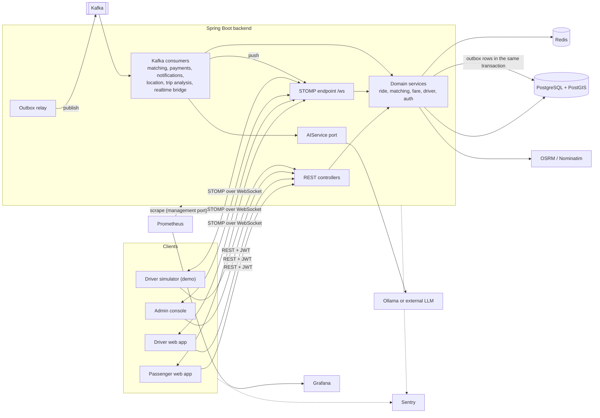

More diagrams in [architecture.md](docs/architecture.md): domain model, ride state machine, matching flow,
location pipeline, Kafka event flow, AI trip analysis, authentication flow, deployment topology and CI/CD.

## 6. Database architecture

PostgreSQL is the system of record: 18 tables, created by versioned Flyway migrations (Hibernate only
validates).

- **Core:** `users`, `refresh_tokens`, `drivers`, `vehicles`, `driver_locations` (current position, one
  row per driver), `rides`, `ride_offers`, `fare_breakdowns`, `payments`, `ratings`, `notifications`.
- **Append-only:** `ride_status_events` (every transition), `ride_track_points` (sampled while in
  progress), `audit_logs`.
- **Events:** `outbox_events` and `processed_events` (consumer idempotency).
- **AI:** `trip_analyses`, `trip_questions`.

Invariants live in the database: `CHECK` constraints for statuses, partial unique indexes for "one active
ride per passenger and per driver" and "one pending offer per driver", and `@Version` on rides. Positions are
`geography(Point, 4326)` generated from plain `lat`/`lng` columns, with GiST indexes. The ER diagram, every
table and the PostGIS query catalogue are in [database.md](docs/database.md).

## 7. Kafka architecture

16 topics, one per event type, each with a dead-letter topic, keyed by ride or driver id and carrying an
aggregate version.

- **Producer side:** domain events are written to `outbox_events` in the transaction that caused them; a relay
  thread, woken by each commit, publishes them (idempotent producer, `acks=all`). Driver positions go straight to
  `driver.location.updated`: they are superseded within seconds, so at-most-once is right for them.
- **Consumers:** `matching`, `payments`, `notifications`, `location-persistence` (batched upserts),
  `trip-analysis`, and the realtime bridge, whose consumer group is unique per instance so every instance
  can push to its own sockets. Shared groups retry with backoff, then dead-letter; `processed_events` makes
  redelivery harmless.
- **Where Kafka is not used:** accept, start, complete, estimate, login and ratings are synchronous,
  because the caller needs the answer.

Topics, payloads and delivery semantics: [events.md §1](docs/events.md#1-kafka);
flow diagram: [architecture.md §10](docs/architecture.md#10-kafka-architecture).

## 8. WebSocket architecture

STOMP over WebSocket at `/ws`, authenticated by the access token in the `CONNECT` frame.

- **Pushes** go to per-user queues (`/user/queue/rides`, `ride-location`, `ride-offers`, `notifications`,
  `presence`, `errors`), with recipients computed by the server at send time, so access ends the moment a
  driver leaves a ride.
- **Driver location** arrives on `/app/drivers/location` (at most one message a second per socket): it is
  validated, stored in Redis, and published to Kafka, from where the bridge pushes it to the ride's passenger
  and a batch consumer writes PostgreSQL.
- **Lifetime:** a socket lives no longer than its access token (the server closes it with code 4001); the
  client reconnects with backoff after refreshing the token, then reloads a snapshot and resubscribes.
- **Presence:** drivers who stop reporting for 2 minutes go offline; a passenger sees "Location signal lost"
  after 30 s.

Channels: [events.md §2](docs/events.md#2-websocket-stomp); pipeline:
[architecture.md §8](docs/architecture.md#8-real-time-location-pipeline).

## 9. Geospatial driver matching

One PostGIS query finds candidates: available, verified drivers of the requested category, seen in the last
30 s, within the round's radius (`ST_DWithin` on a GiST index), nearest first (KNN `<->`). Redis GEO could not
join those relational filters in one step, and loading drivers into Java would be linear per request.

Matching runs in the Kafka `matching` consumer: round 1 searches 3 km and offers the ride to up to three
drivers for 20 s; later rounds grow by 1.5× up to 8 km, for at most three rounds, then the ride expires.
The first accept wins, serialised on the ride's row lock; the others get `409`. All state is in
PostgreSQL, and a sweeper every 5 s picks up rides whose trigger was late or lost, so matching survives a
Kafka outage or a restart. `NearbyDriverQueryIT` checks the results against real PostGIS and that the query
uses the spatial index. Details: [architecture.md §7](docs/architecture.md#7-geospatial-driver-matching).

## 10. Redis strategy

Redis holds only ephemeral, recomputable or protective state; rides are never cached.

| Key | Why |
|---|---|
| `route:*` (15 min) | Routing is an external call and most of an estimate's latency |
| `surge:{geohash6}` (60 s) | Two PostGIS counts per estimate become one per map cell per minute |
| `geocode:*` (24 h) | Nominatim's policy requires caching and allows one request a second |
| `ride:{id}:eta` (30 s) | Drivers report every few seconds; the ETA is routed once per 30 s, not per report |
| `driver:{id}:location`, `driver:{id}:state` | The live position and the state each report needs, without database reads |
| `rl:*` | Rate limits shared by all instances (Lua fixed window, `Retry-After`) |

Redis is optional at runtime: caches fall back to computing, rate limits fail open, and a 5-second circuit
avoids a timeout per call during an outage. Measured with stand-ins for OSRM and Nominatim that answer as
slowly as the real servers did from the same runner: the fare estimate's p95 went from 744.8 ms to 17.2 ms
(40 to 2,228 requests/s), and place search's from 372.7 ms to 11.3 ms
([performance.md](docs/performance.md#cache-benchmark-phase-5)).
Every key: [architecture.md §9](docs/architecture.md#9-redis-strategy).

## 11. AI architecture

After a ride completes, the `trip-analysis` consumer asks the model to explain it, and passengers can ask
questions about their trip.

- **Grounded input:** `TripFactsAssembler` builds keyed facts from the database (fares and line items,
  estimated against actual distance and duration, detour, the passenger's own averages). No names,
  addresses or coordinates leave the backend.
- **Checked output:** `AIResponseValidator` rejects unknown fields, facts that were not supplied, and any
  number that is not a supplied value. A rejected answer gets one corrective retry with the reasons; a
  second rejection is stored as failed, and nothing unchecked reaches the passenger.
- **Isolated failures:** a bulkhead, a circuit breaker and bounded retries around the provider. A model that
  is slow, down or wrong never touches the ride, and the deterministic observations are shown either way.
- **Providers:** Ollama (local), the Anthropic API (external) or disabled, chosen by `AI_PROVIDER`.
  Prompts are versioned and the version is stored with each answer.

Recorded runs with local 7B models found real problems (a model that blamed surge when distance was the
cause; one that followed a prompt injection; a timeout that did not bound the call) and what was changed:
[ai.md](docs/ai.md).

## 12. Security

- **Authentication:** JWT access tokens (HS256, 15 min, in memory on the client) and rotating opaque
  refresh tokens in an HttpOnly cookie (Secure except on plain-http localhost), stored hashed; reuse of a rotated token revokes the whole
  family. Passwords use BCrypt at strength 12.
- **Authorisation:** role rules on every path, and ownership checks in services. A resource the caller
  may not see is a `404`, not a `403`. Admins cannot self-register.
- **WebSocket:** token at `CONNECT`, deny-by-default subscription and send rules, sockets closed when the
  token expires.
- **Hardening:** CORS allow-list, security headers, Bean Validation on every request, parameterised
  queries only, Redis rate limits, stack traces never returned, and the actuator only on a separate,
  non-public port.
- **Secrets:** only from the environment; `init-env.sh` generates local ones, gitleaks scans the whole
  history on every push, and error reports are scrubbed of emails, tokens and query strings.
- **Client addresses:** forwarding headers count only from listed proxies, and behind Vercel the
  frontend signs the visitor's address for the backend, so a client cannot pick a fresh login or
  registration limit by sending its own `X-Forwarded-For`
  ([architecture.md §9](docs/architecture.md#9-redis-strategy)).

Details: [architecture.md §13](docs/architecture.md#13-security).

## 13. Testing

| Suite | What | Count |
|---|---|---|
| Backend unit, web slice, ArchUnit | Fare calculation, every state-machine edge, surge, AI validation, security rules, error shape, signed client addresses, startup checks, module boundaries | 326 tests |
| Backend integration | Real PostGIS, Redis, Kafka and Redpanda (Testcontainers): outbox to consumer, dead letters, redelivery, the concurrent-accept race, rate limits (including forged forwarding headers), caching, billing when the GPS trail is missing, STOMP authorisation, the AI failure matrix (WireMock), Sentry scrubbing, and `RideWorkflowIT`, one ride from booking to earnings over HTTP, STOMP and Kafka | 75 tests in 16 classes |
| Frontend | Vitest and Testing Library: forms and the login redirect, the realtime reconnect protocol, driver location reports, the active-ride hook, driver trip controls, booking, the signed client address | 102 tests (and 4 simulator tests) |
| End to end | Playwright against the Docker Compose stack: a passenger's ride with a simulated driver, a new driver from sign-up to earnings, a cancellation, the admin console, the Grafana dashboards | 6 tests |

Coverage (JaCoCo, unit and integration together): 91.2 % of lines overall; the service layer is at 91.5 %
of lines and 74.6 % of branches, with a CI gate at 88 % and 70 %. How to run each suite:
[development.md](docs/development.md#tests).

## 14. Docker setup

```bash
./scripts/init-env.sh                       # writes .env with random secrets (never overwrites one)
docker compose --profile demo up --build    # everything, plus the driver simulator
```

- **Services:** PostGIS, Redis, Kafka, backend and frontend, started in health order, plus Prometheus and
  Grafana.
- **Addresses:** the app is at <http://localhost:3000>, Grafana at <http://localhost:3001>. The demo
  accounts' password is `DEMO_USER_PASSWORD` in `.env`.
- **Images:**
  - The backend image is a layered jar on a JRE, run as a non-root user.
  - The frontend image is Next's standalone server.
  - The simulator image runs its TypeScript on Node 24.
- **Infrastructure only:** `docker compose up -d postgres redis kafka` gives host development just the
  infrastructure.

Host development without Docker for the apps: [development.md](docs/development.md#apps-on-the-host).

## 15. Monitoring

- **Metrics:** Micrometer on the management port, scraped by Prometheus every 10 s. Ride pipeline
  counters (counted only after the transaction commits), matching time, offer outcomes, location reports,
  WebSocket sessions, outbox backlog, dead letters, cache hits, rate limits and AI calls, besides HTTP,
  JVM, pool and Kafka client metrics.
- **Dashboards:** Grafana provisions *Service overview*, *Ride pipeline*, *Real-time & cache* and *AI*. CI
  runs every panel's query after its rides and fails on an error or on an empty panel the rides must
  fill.
- **Errors:** Sentry for backend and frontend, off without a DSN, with personal data and credentials
  scrubbed before sending; Admin → System sends a test error.
- **Logs:** structured JSON with a trace id per request.

[development.md](docs/development.md#monitoring) · [architecture.md §15](docs/architecture.md#15-observability)

## 16. Load testing

k6 scenarios at 10, 50 and 100 virtual users, run in CI against the compose stack on one 4-vCPU runner
(k6 included), 60 s each, with no failed request in any of the 12 runs:

| Scenario | 10 VUs | 100 VUs |
|---|---|---|
| Login (BCrypt 12, CPU-bound by design) | 8.2/s, p95 2.1 s | 9.8/s, p95 19.4 s |
| Nearby-driver search | 1,491/s, p95 13 ms | 1,872/s, p95 112 ms |
| Book a ride | 199/s, p95 38 ms | 349/s, p95 327 ms |
| Whole rides (book to complete) | 1,066 in 60 s, offer seen p95 284 ms | 2,904 in 60 s, offer seen p95 2.6 s |

What limits each one (and what was not measured) is in
[performance.md](docs/performance.md#scenario-load-tests-phase-12); the scripts are in
[load-tests/](load-tests/README.md).

## 17. Deployment

The prepared deployment runs on free tiers in Singapore:
- **Frontend:** Vercel.
- **Backend:** the GHCR image that CI tested, on Render, with the managed services below.
- **Database:** Neon PostgreSQL with PostGIS.
- **Redis:** Upstash.
- **Kafka:** Redpanda Serverless, a 30-day trial, since no permanent free tier fits 32 topics.

On `main`, the e2e workflow publishes the images and asks Render to deploy the backend by its commit tag.
A CI check runs the backend at the free plan's 512 MB and 0.1 CPU:
- it peaked at 441 MiB
- it started in 180 s
- it completed rides
- logins were slow, 8.5 s at the median

Setup, limits and trade-offs: [deployment.md](docs/deployment.md).

## 18. Environment variables

Every setting comes from the environment; `.env.example` lists them, and the backend refuses to start
without a required one. The ones to know:

| Variable | Purpose |
|---|---|
| `DATABASE_URL`, `DATABASE_USERNAME`, `DATABASE_PASSWORD` | PostgreSQL |
| `REDIS_HOST`, `REDIS_PASSWORD`, `REDIS_SSL_ENABLED` | Redis |
| `KAFKA_BOOTSTRAP_SERVERS`, `KAFKA_SECURITY_PROTOCOL`, `KAFKA_USERNAME`, `KAFKA_PASSWORD` | Kafka (plaintext locally, SASL_SSL managed) |
| `JWT_SECRET` | Signs access tokens and fare quotes (at least 32 bytes) |
| `CORS_ALLOWED_ORIGINS` | The frontend's origin, for CORS and the WebSocket |
| `SPRING_PROFILES_ACTIVE` | `demo` (seed accounts) and/or `prod` (JSON logs, API docs off) |
| `AI_PROVIDER`, `AI_LOCAL_MODEL`, `ANTHROPIC_API_KEY` | AI provider |
| `SENTRY_DSN`, `NEXT_PUBLIC_SENTRY_DSN` | Error reporting (off when empty) |
| `BACKEND_URL`, `NEXT_PUBLIC_WS_URL` | Where the frontend sends `/api` and opens the WebSocket (build time) |

All of them, with defaults: [development.md](docs/development.md#environment-variables).

## 19. API documentation

- [api.md](docs/api.md): every endpoint with its role, request, response and error codes, plus
  conventions (error shape, pagination).
- [openapi.json](docs/openapi.json): the OpenAPI 3.1 contract, generated from the controllers.
  `OpenApiContractTest` fails if the code and the file differ, and frontend-ci fails if the frontend's
  generated API types are out of date.
- Swagger UI on a running backend: <http://localhost:8080/swagger-ui.html> (off under the `prod` profile).
- [events.md](docs/events.md): Kafka topics and payloads, WebSocket destinations.

## 20. Screenshots

Taken by the Playwright suite during a passing e2e run against the Docker Compose stack, with the
simulator's drivers; see [docs/screenshots](docs/screenshots/README.md) for the run.

| | |
|---|---|
| 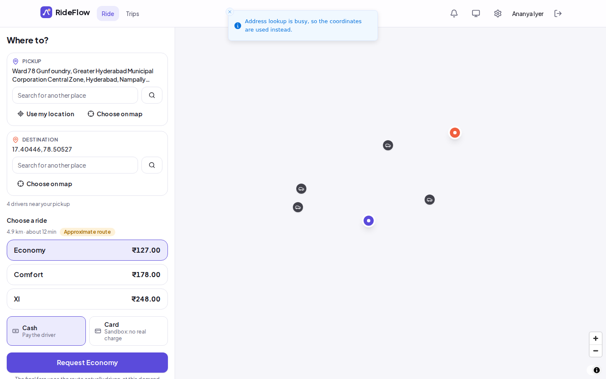 Booking with fare options and nearby drivers | 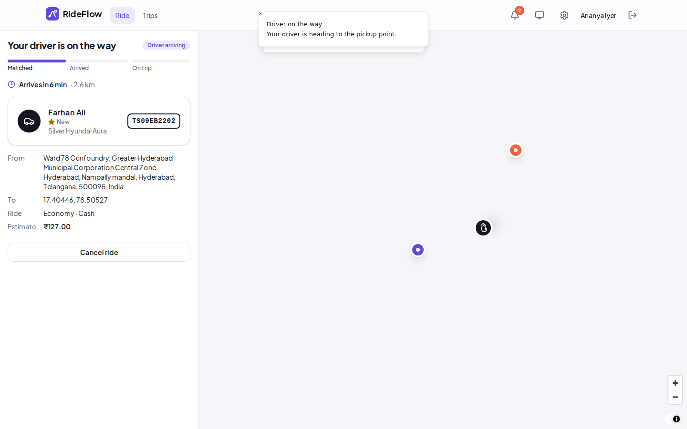 The live ride with the assigned driver |
| 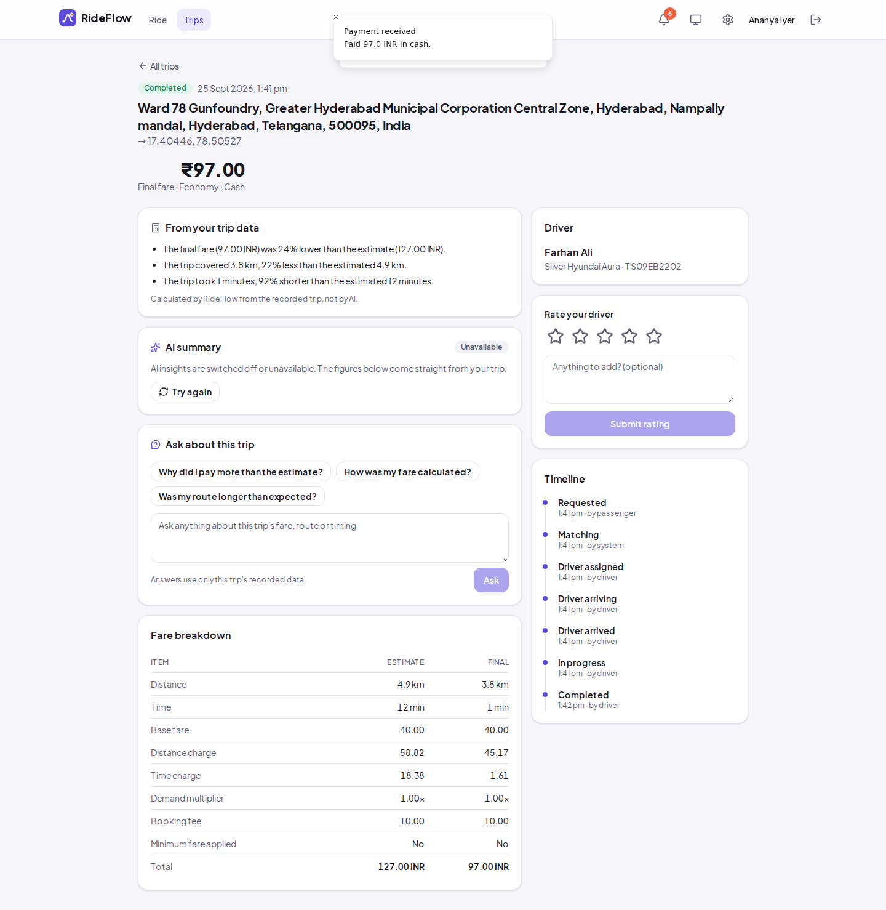 Trip details: fare breakdown and observations | 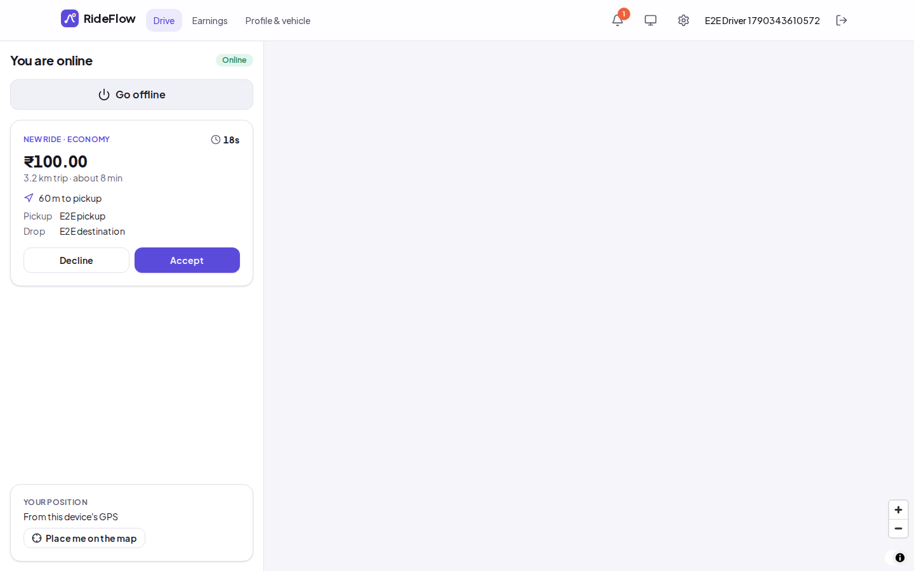 A driver's incoming offer |
| 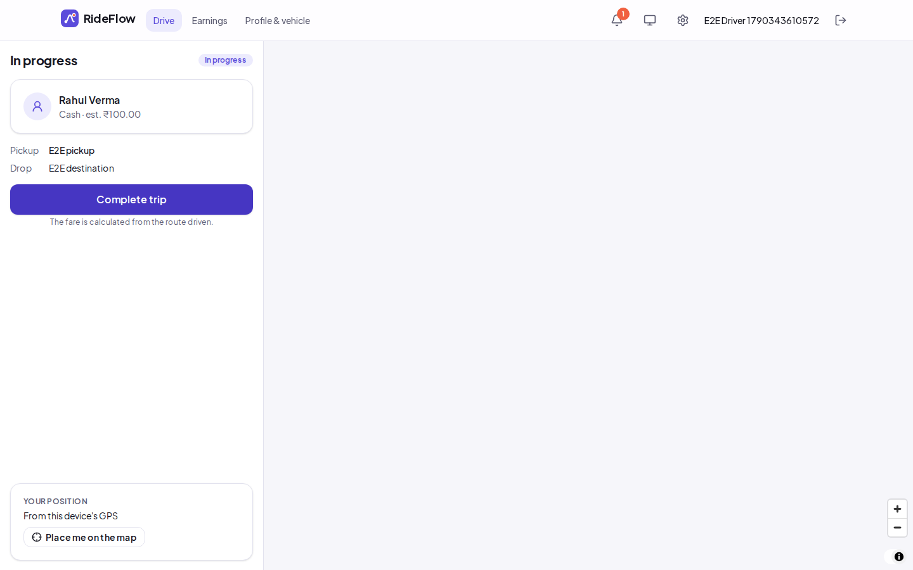 A driver's trip in progress | 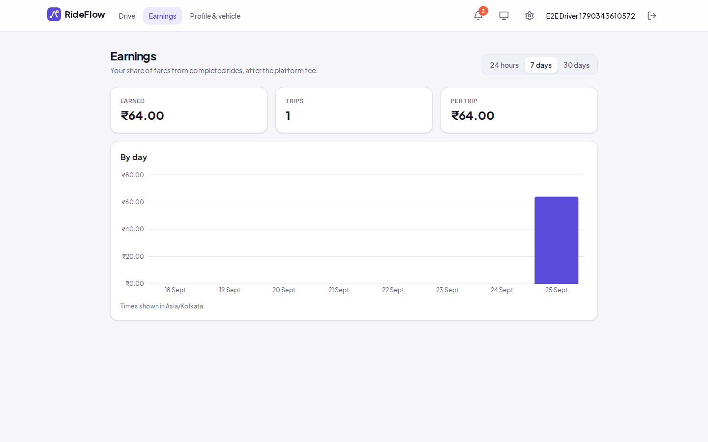 Driver earnings |
| 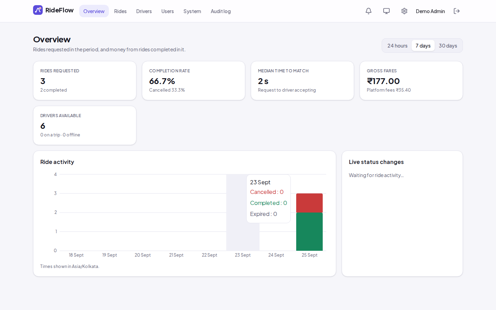 Admin overview | 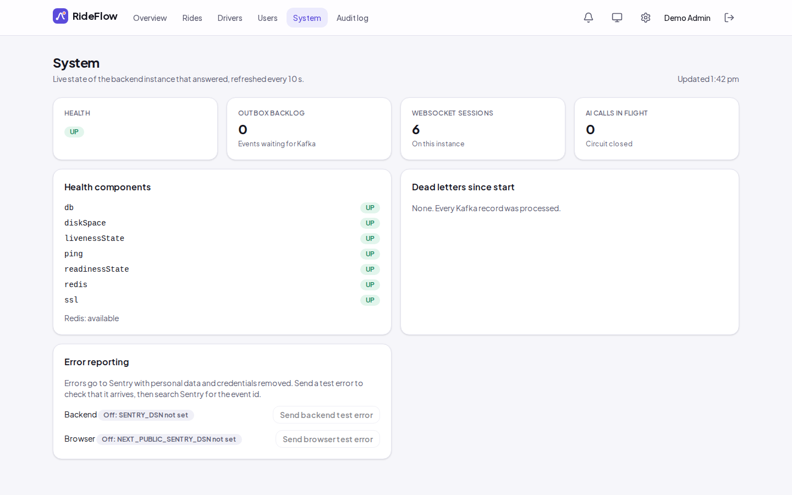 Admin → System |
| 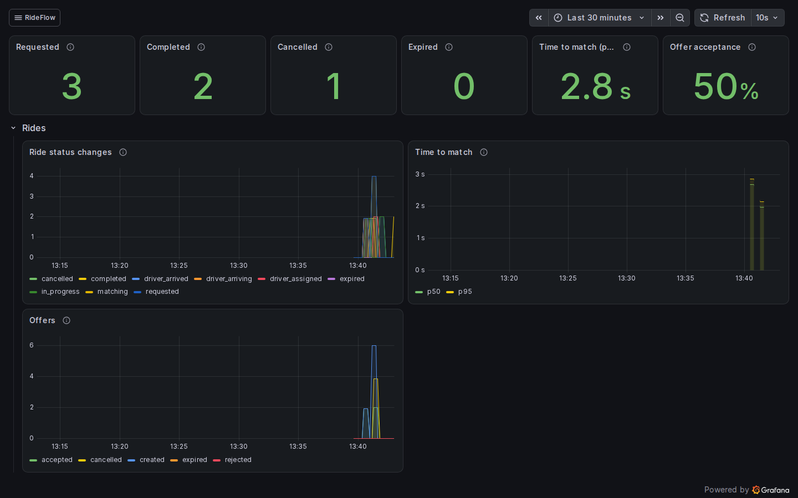 Grafana: ride pipeline | 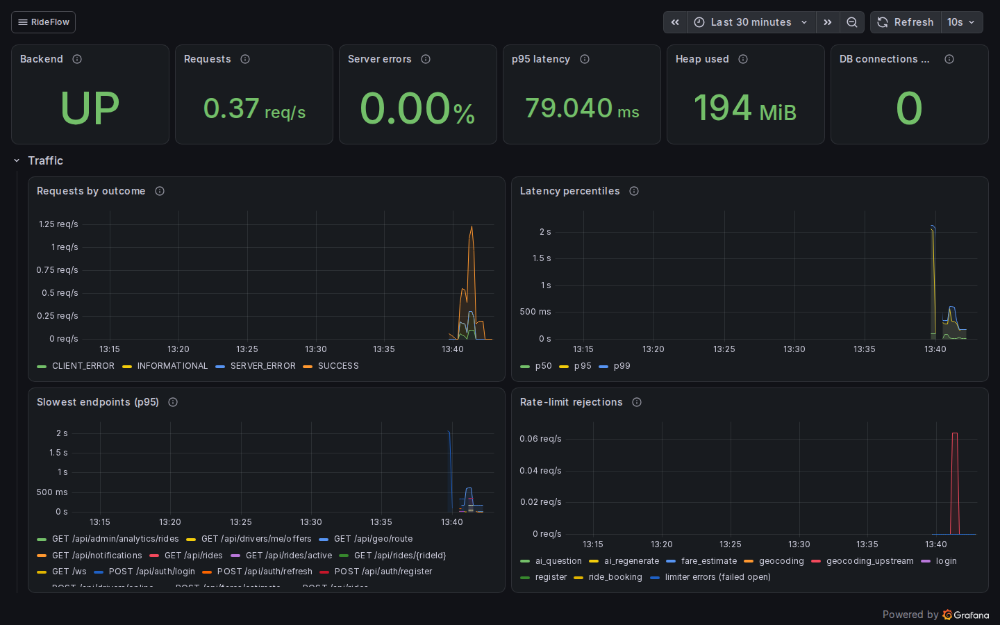 Grafana: service overview |

AI is disabled in CI (no model on the runner), so the trip details show the deterministic observations and
no model answer; recorded model answers are in [ai.md](docs/ai.md#5-recorded-runs).

## 21. Future improvements

- **Scale:**
  - Matching listener concurrency equal to the partition count, measured with the lifecycle scenario.
  - Recording connection-pool waits and consumer lag during load runs.
  - A dedicated realtime gateway for very high fan-out.
- **Deployment:** the public demo.
- **Events:** Avro with a schema registry once a consumer becomes a separate service; OpenTelemetry tracing
  across HTTP and Kafka.
- **Product:**
  - Service areas as PostGIS polygons managed by admins.
  - Stripe test mode behind the existing payment port.
  - SMS and email notifications.
  - Pooled rides.
- **Operations:** Sentry source maps; metrics from the deployment, behind authentication.

## Documentation

[Architecture](docs/architecture.md) · [Database](docs/database.md) · [API](docs/api.md) ·
[Events](docs/events.md) · [AI](docs/ai.md) · [Development](docs/development.md) ·
[Deployment](docs/deployment.md) · [Performance](docs/performance.md) ·
[Implementation plan](docs/implementation-plan.md)

## License

[MIT](LICENSE)
