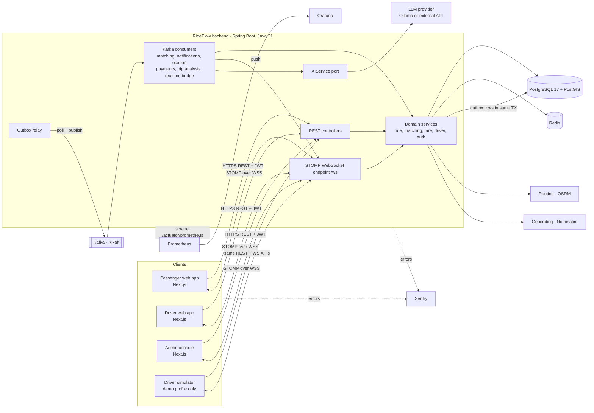
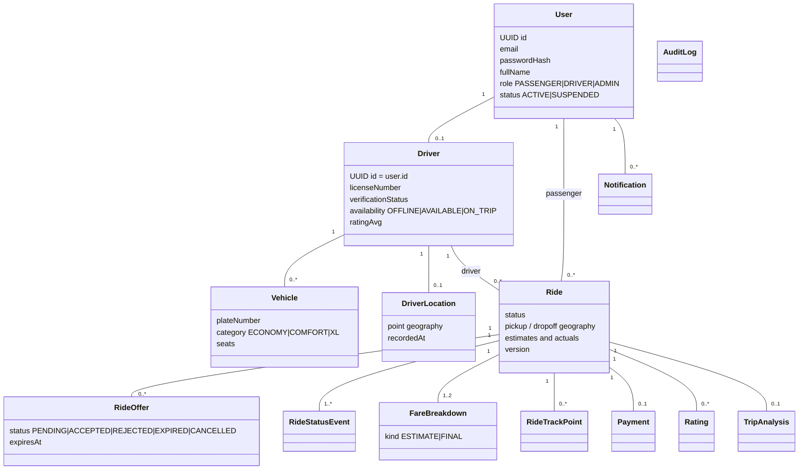
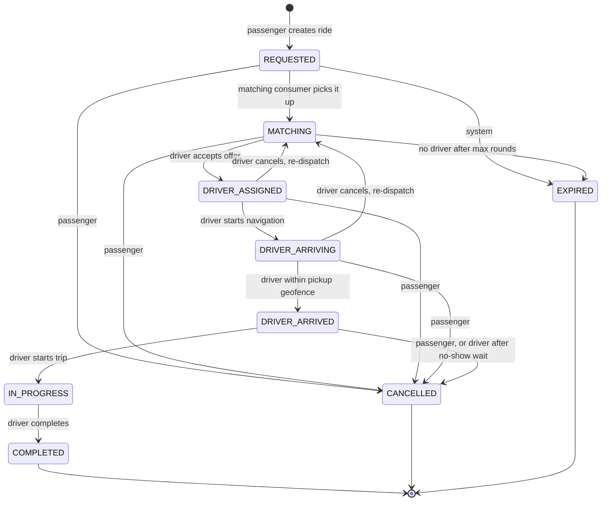
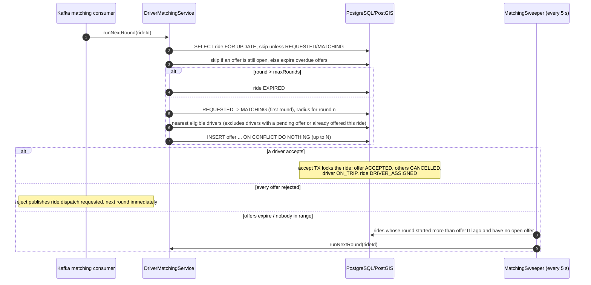
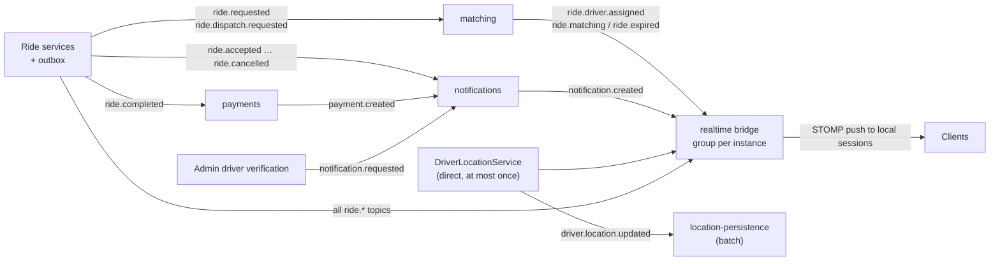
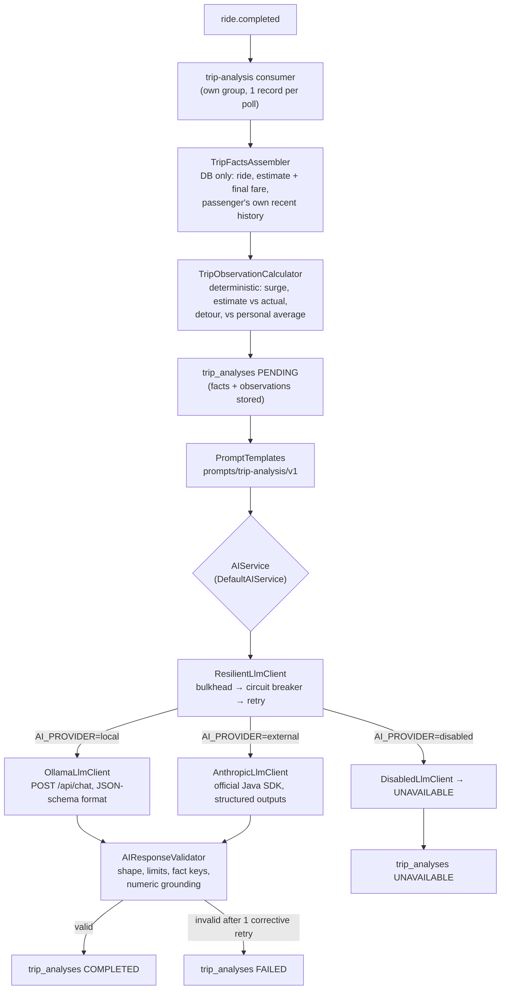
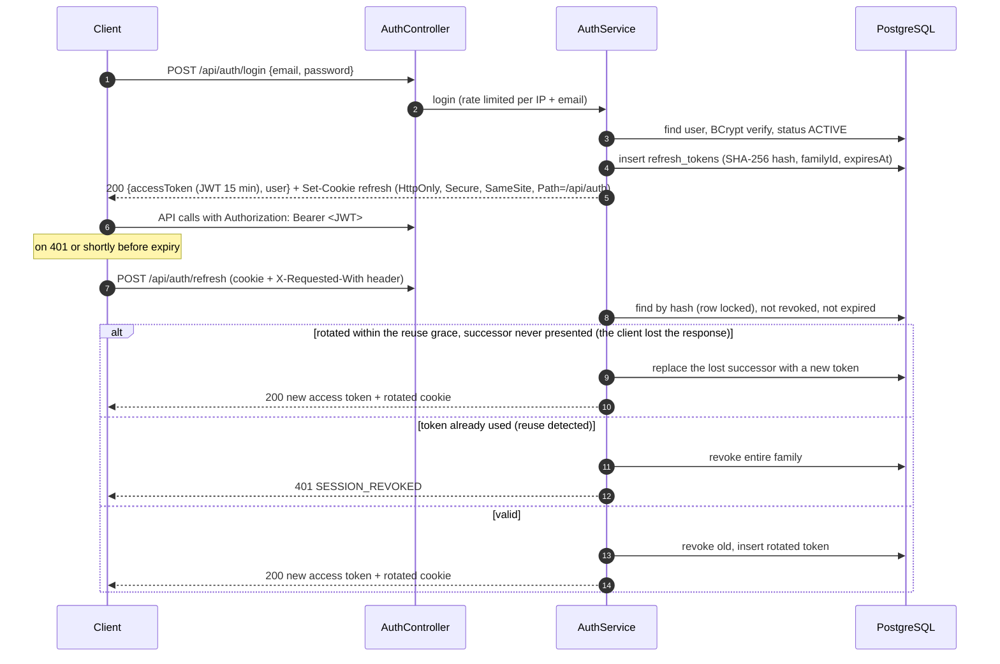
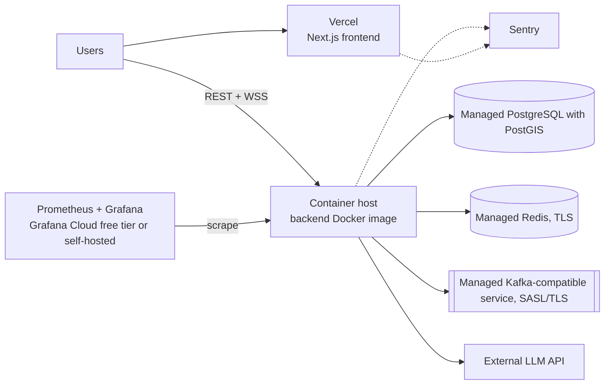
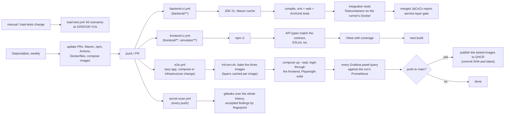

# RideFlow — Architecture

> Status: **Phase 1 (design)**. This document is the source of truth for architectural decisions.
> Detailed contracts live in companion documents:
>
> - [database.md](database.md) — schema, constraints, indexes, PostGIS queries
> - [api.md](api.md) — REST contracts, error model, pagination
> - [events.md](events.md) — Kafka topics, event schemas, WebSocket channels
> - [implementation-plan.md](implementation-plan.md) — phased delivery plan and definition of done

---

## 1. Product overview

RideFlow is a real-time ride-hailing platform with three roles:

| Role | Core journey |
|---|---|
| **Passenger** | Sign in → choose pickup/destination → see backend-calculated fare quotes → request → watch matching → track driver live → ride → pay → rate → AI Trip Intelligence |
| **Driver** | Sign in → onboarding (licence + vehicle) → admin verification → go online → stream location → receive offer → accept/reject → navigate → arrive → start → complete → earnings |
| **Admin** | Overview → users → driver verification → rides → system health → analytics |

Everything dynamic on screen is sourced from PostgreSQL, Redis, Kafka-driven WebSocket pushes, or computed by the backend. Demo seed data is isolated in a separate Flyway location that is only enabled under the `demo` profile (see §19).

---

## 2. Architectural style

**A modular monolith (one Spring Boot deployable) + asynchronous event processing through Kafka.**

Why not microservices: the domain has one consistency-critical aggregate (the ride) whose state transitions, driver availability and offers must change atomically. Splitting these across services would require distributed transactions or sagas for no portfolio-scale benefit. Instead, the monolith is split into internal modules with strict dependency rules (enforced by ArchUnit tests), and **Kafka provides the asynchronous seams** where work genuinely should not block a request: driver matching, notifications, location persistence, payments, AI analysis. Any of those consumers could later be extracted into its own service without changing producers.

### 2.1 Key decisions (ADR summary)

| # | Decision | Alternatives considered | Why |
|---|---|---|---|
| D1 | Modular monolith | Microservices | One engineer can explain and operate it; ride consistency stays in one DB transaction. |
| D2 | PostgreSQL + PostGIS as system of record | MongoDB geo, Redis GEO only | Relational integrity for rides/payments + index-backed spatial queries that can **join** spatial filters with relational filters (verification, availability, vehicle category). |
| D3 | Flyway migrations, `ddl-auto=validate` | Hibernate auto-DDL | Schema is reviewed, versioned SQL; Hibernate only validates that entities match. |
| D4 | Hot location path = WebSocket → Redis → Kafka; PostgreSQL is written by a **batched consumer** | Write every GPS ping to PostgreSQL | GPS updates are high-frequency and only the latest value matters. Coalescing in a batch consumer turns N writes/driver/interval into 1 upsert. |
| D5 | Transactional outbox for domain events | `kafkaTemplate.send()` inside the service; after-commit listener | Avoids the dual-write problem: an event is published **iff** the DB transaction committed, even across crashes. |
| D6 | Per-event-type Kafka topics, keyed by `rideId`/`driverId`, events carry `aggregateVersion` | Single `ride.events` topic | Matches the domain vocabulary and lets consumers subscribe narrowly; consumers use `aggregateVersion` to discard out-of-order updates. |
| D7 | Realtime bridge consumes Kafka with an **instance-unique consumer group** and pushes to the local STOMP broker | Direct in-process push; RabbitMQ STOMP relay | Every backend instance receives every event, so a passenger connected to instance B still gets updates caused on instance A. No extra broker. |
| D8 | JWT access tokens (15 min) + rotating opaque refresh tokens (hashed in PostgreSQL) | Server sessions; long-lived JWTs | Stateless API + WebSocket auth, with real revocation and reuse detection via refresh-token families. |
| D9 | Spring Security OAuth2 Resource Server for JWT validation | Hand-written JWT filter | Less custom security code; standard, well-tested validation. |
| D10 | Enums stored as `varchar` + `CHECK` constraints | PostgreSQL `ENUM` types | Adding a value is a simple constraint change inside a normal migration. |
| D11 | Optimistic locking (`@Version`) on `rides` + partial unique indexes | Pessimistic row locks everywhere | Two drivers accepting simultaneously → exactly one wins, the other gets `409`. DB indexes are the final backstop for "one active ride per passenger/driver". |
| D12 | AI behind `AIService` port with local (Ollama) and external implementations | Direct SDK calls from ride code | Provider-agnostic; AI failures are isolated from the ride lifecycle. |
| D13 | Map/routing/geocoding behind provider interfaces (MapLibre + OpenFreeMap, OSRM, Nominatim) | Google Maps SDK | No API key required for development; each provider replaceable via configuration. |
| D14 | Kafka in **KRaft** mode | ZooKeeper | ZooKeeper was removed in Kafka 4.x; one fewer container. |
| D15 | JSON event payloads with explicit `schemaVersion`, additive-only evolution | Avro + Schema Registry | Adequate for a single producer codebase; Schema Registry is listed as a future improvement. |
| D16 | Fare quotes are **HMAC-signed tokens** (`base64url(json).base64url(hmac)`), bound to the passenger, with expiry | Quote rows in Redis | No storage, survives restarts, works across instances, tamper-proof. The key is derived from the JWT secret with a distinct label, so a quote can never be replayed as an access token. Double booking is already prevented by `ux_rides_passenger_active`. *(Changed in Phase 3.)* |
| D17 | "One pending offer per driver" is a **partial unique index** (`ride_offers(driver_id) WHERE status='PENDING'`) with `INSERT … ON CONFLICT DO NOTHING` | Redis `SET NX` lock | Atomic with the offer insert, no second system that can disagree with the database. *(Changed in Phase 3.)* |
| D18 | Rides store `lat`/`lng`; PostGIS **generated columns** derive `geography` from them | Hibernate Spatial / JTS mapping | Entities stay plain Java while every spatial query and GiST index still uses real PostGIS geography. |
| D19 | **Lock ordering:** every transaction that mutates a ride locks the ride row (`SELECT … FOR UPDATE`) before touching its offers | Optimistic locking alone | Concurrent accept, cancel and matching serialise per ride and cannot deadlock; the optimistic `@Version` stays as a backstop. |
| D20 | Pushes go to **per-user queues** (`/user/queue/rides`, `/ride-location`, `/ride-offers`), with recipients computed by the server when it sends | Per-ride topics (`/topic/rides/{id}/…`) authorised at SUBSCRIBE time against a Redis participants key | A subscription authorised once stays open when access changes. A driver who withdraws from a ride would keep receiving its updates, including the next driver's details. Computing recipients from current data closes that gap and removes a cache that must be kept in step with the database. Cost: the payload names its `rideId`, and a user with several sessions receives the update on each, which is what a user with two tabs needs anyway. *(Changed in Phase 4.)* |
| D21 | **A socket lives no longer than its access token:** frames are refused after `exp`, and the server closes the socket (code 4001) | Validate only at CONNECT | Access tokens are short-lived because they cannot be revoked. A socket that outlived its token would turn a 15-minute credential into an unlimited one for everything pushed to it, such as live driver positions. Clients already refresh the token before reconnecting. *(Added in Phase 4.)* |
| D22 | **Redis is optional at runtime:** caches and rate limits fail open, a small circuit skips Redis for 5 s after a failure, and readiness ignores it | Treat Redis as a hard dependency | Everything in Redis is recomputable or protective. An outage should cost some latency and a window without rate limits (visible in metrics), not an outage of logins and bookings. *(Added in Phase 5.)* |
| D23 | Driver positions: **Redis holds the live position, PostgreSQL gets batches from Kafka**. Both were introduced together in Phase 6 | Redis location keys in Phase 5, while every report was still written to PostgreSQL | A Redis copy only pays off once it takes the per-report write off PostgreSQL; before that it was a second write and a second source of truth for the geofence. *(Decided in Phase 5, implemented in Phase 6.)* |
| D24 | Kafka payloads are the **domain event records** (`RideStatusChangedEvent`, …) inside a versioned envelope; readers ignore unknown fields | Separate payload DTOs mapped from domain events | Producer and consumer are one codebase, so a mapping layer would duplicate every record without decoupling anything. Additive changes need no version bump. If a consumer is ever extracted into its own service, the records move into a shared schema module (or Avro, D15). *(Added in Phase 6.)* |
| D25 | **One topic per target ride status** (`ride.accepted`, `ride.completed`, …) plus `ride.dispatch.requested` for early matching rounds | One `ride.status-changed` topic | Consumers subscribe to the transitions they act on; payments reads only `ride.completed`. Cost: no ordering across a ride's topics, which consumers tolerate through `aggregateVersion` and state checks (events.md §1.4). *(Added in Phase 6.)* |
| D26 | The outbox relay is a **dedicated thread woken by commits**, with a 250 ms poll as a backstop | `@Scheduled` poller only; CDC (Debezium) | A commit hook makes events leave within milliseconds instead of on average half a poll interval. The relay also keeps running when scheduled jobs are disabled. CDC would need Kafka Connect and replication-slot management for no gain at this scale. *(Added in Phase 6.)* |
| D27 | Driver state in Redis (`driver:{id}:state`) is **rewritten after every commit** that changes it; a cache miss loads from the database and stores with `SET NX` | Delete on change (cache-aside), or a short TTL only | With delete-on-change, a location report that read the database just before a ride started could write the old state back after the delete. That would miss track points and time the wrong stop until the TTL expired. A write after commit plus `NX` loads means a load can never overwrite a newer state. *(Added in Phase 6.)* |

---

## 3. System architecture



---

## 4. Backend structure

Top-level packages follow the requested layered structure; inside `service`, code is grouped by feature so no package becomes a dumping ground.

```
backend/src/main/java/com/rideflow/
├── RideFlowApplication.java
├── config/          # Security, Jackson, Kafka, Redis, WebSocket, OpenAPI, CORS, properties binding
├── controller/      # Thin REST controllers: validate DTO → call service → map response
├── service/
│   ├── auth/        # registration, login, refresh-token rotation
│   ├── user/
│   ├── driver/      # onboarding, verification, availability, location ingestion and persistence
│   ├── ride/        # RideService, RideStateMachine, RideQueryService
│   ├── matching/    # DriverMatchingService, OfferService, MatchingSweeper
│   ├── fare/        # FareCalculator, SurgeService, FareQuoteService
│   ├── payment/     # PaymentService, PaymentGateway port
│   ├── rating/
│   ├── notification/
│   ├── ai/          # TripFactsAssembler, observations, TripInsightsService, analysis runner
│   ├── analytics/   # admin overview / time series (read-only queries)
│   └── audit/
├── repository/      # Spring Data JPA repositories + native PostGIS queries
├── entity/          # JPA entities + enums
├── dto/             # request/response records (never entities over the wire)
├── mapper/          # MapStruct mappers entity ↔ DTO
├── security/        # JWT issuing, refresh tokens, principal
├── exception/       # domain exceptions + GlobalExceptionHandler + ApiError
├── websocket/       # STOMP auth + authorisation interceptors, message handlers, pushes, session registry
├── kafka/         # adapters: KafkaLocationStream (positions, direct)
│   ├── event/       # EventTopic (topic catalogue), envelope, EventCodec, KafkaNames
│   ├── outbox/      # OutboxDomainEventPublisher, OutboxRelay, OutboxPublisher, housekeeping
│   └── consumer/    # thin listeners: decode, then delegate to a service or the realtime publisher
├── geospatial/      # GeoPoint value object, RoutingProvider, GeocodingProvider, PostGIS helpers
├── cache/           # Redis key registry, rate limiter, typed cache helpers
├── ai/              # AIService, LlmClient (Ollama, Anthropic, disabled), ResilientLlmClient, prompts, validator
├── monitoring/      # custom Micrometer metrics, Sentry scrubbing
└── utility/         # small pure helpers (clock, money rounding)
```

**Dependency rules** (checked by ArchUnit in CI):

- `controller` → `service`, `dto` only (never `repository` or `entity`).
- `kafka.consumer` → `service` and the `websocket` publisher only (no repositories, no entities, no transactions of its own).
- `service` never depends on `kafka`: services publish through ports (`DomainEventPublisher`, `LocationStream`).
- `entity` depends on nothing application-specific.
- Services own transactions (`@Transactional` at service method level, never on controllers).

---

## 5. Domain model



**Invariants enforced in code and in the database:**

1. A passenger has at most one active ride; a driver has at most one active ride (partial unique indexes).
2. Ride status only changes through `RideStateMachine` (§6); every change writes a `ride_status_events` row and an outbox event in the same transaction.
3. A driver can only go online when `verification_status = VERIFIED` and they have an active vehicle.
4. A driver holds at most one pending offer at a time (partial unique index, D17).
5. Money is `numeric(10,2)` / `BigDecimal`, never floating point.
6. Fares are snapshotted (`fare_breakdowns`) so historical rides remain explainable even if pricing config changes.

A separate passenger-profile table is intentionally **omitted**: passengers have no attributes beyond `users` today. Drivers use a shared primary key (`drivers.id = users.id`), so `driverId == userId` everywhere (JWT subject, WebSocket user, APIs).

---

## 6. Ride state machine



Implementation: `RideStateMachine` holds an immutable `EnumMap<RideStatus, Map<RideStatus, Set<ActorType>>>`. `transition(ride, target, actor, reason)` throws `InvalidRideTransitionException` (HTTP 409, code `RIDE_INVALID_TRANSITION`) if the edge or actor is not allowed. It is the **only** code path that mutates `ride.status`; the entity setter is package-private. Guards that need data (e.g. the pickup geofence radius, no-show wait time) are configuration properties checked by `RideService` before calling the state machine.

---

## 7. Geospatial driver matching

### 7.1 Why PostGIS

The candidate search combines a spatial predicate ("within R metres") with relational predicates (verified, available, category, recently seen) and must sort by true distance. PostGIS evaluates all of it in one index-assisted query close to the data. Loading all drivers into Java would be O(n) per request and transfer every row over the network. Redis GEO is fast but cannot join against verification/vehicle data without a second round trip per candidate and gives no transactional consistency with driver availability.

### 7.2 Core query

```sql
SELECT d.id                                         AS driver_id,
       v.id                                         AS vehicle_id,
       ST_Distance(dl.location, :pickup)            AS distance_m
FROM   driver_locations dl
JOIN   drivers  d ON d.id = dl.driver_id
JOIN   vehicles v ON v.driver_id = d.id AND v.active
WHERE  d.availability        = 'AVAILABLE'
  AND  d.verification_status = 'VERIFIED'
  AND  v.category            = :category
  AND  dl.updated_at         > now() - make_interval(secs => :freshnessSeconds)
  AND  ST_DWithin(dl.location, :pickup, :radiusMeters)   -- GiST index
ORDER  BY dl.location <-> :pickup                          -- KNN via GiST
LIMIT  :candidateLimit;
-- :pickup = ST_SetSRID(ST_MakePoint(:lng, :lat), 4326)::geography   (longitude first!)
```

- `geography(Point, 4326)` gives distances in metres on the spheroid without manual projection.
- `ST_DWithin` on geography uses the GiST index `ix_driver_locations_location`; `<->` gives index-ordered nearest-neighbour.
- `NearbyDriverQueryIT` verifies radius, ordering, true distances, freshness, category and eligibility filters against real PostGIS, and asserts that `EXPLAIN` of the proximity query uses `ix_driver_locations_location`. Implementation: `DriverLocationRepository.findAvailableNear`.

### 7.3 Matching flow



Tunables (`rideflow.matching.*`): initial radius 3 km, growth factor 1.5 (3 km, 4.5 km, 6.75 km), max radius 8 km, max rounds 3, candidate limit 10, offers per round 3, offer TTL 20 s, location freshness 30 s. Sending up to three concurrent offers reduces passenger wait; the first accept wins (serialised on the ride row lock) and the others get `409 RIDE_ALREADY_ASSIGNED`.

State lives entirely in PostgreSQL, so matching is restart-safe: if the Kafka trigger is late or lost (for example while Kafka is down), the sweeper picks the ride up. Every instance can run the sweeper, because `runNextRound` locks the ride and re-checks every precondition. A driver who withdraws before pickup puts the ride back into `MATCHING` from round one, and is never re-offered the same ride (`UNIQUE (ride_id, driver_id)`).

*Trigger:* the `matching` consumer group reads `ride.requested` (new rides) and `ride.dispatch.requested` (last offer rejected, or driver backed out). It records each event in `processed_events` in the round's transaction, because re-running a redelivered trigger could start the next round before the current one timed out. Until Phase 6 the trigger was an in-process after-commit listener behind the same `DomainEventPublisher` port; the matching service did not change.

---

## 8. Real-time location pipeline

Implemented in Phase 6 (before that, every report was written to PostgreSQL synchronously). `STOMP /app/drivers/location` and `POST /api/drivers/location` both go to `DriverLocationService`.

```mermaid
sequenceDiagram
    autonumber
    participant D as Driver app / simulator
    participant WS as STOMP /app/drivers/location
    participant L as LocationIngestionService
    participant R as Redis
    participant K as Kafka driver.location.updated
    participant B as Realtime bridge (every instance)
    participant P as Passenger app
    participant C as Location persistence consumer
    participant PG as PostgreSQL

    D->>WS: SEND {lat,lng,heading,speed,accuracy,recordedAt}
    WS->>L: authenticated DRIVER principal
    L->>L: validate ranges and clock skew (the socket is throttled to 1 msg/s)
    L->>R: GET driver:{id}:state (availability + active ride; DB on a miss)
    L->>R: Lua: store driver:{id}:location if not older, TTL 5 min
    L->>K: produce keyed by driverId, with rideId, passengerId, status, next stop
    K->>B: consume (instance-unique group)
    B->>P: /user/{passengerId}/queue/ride-location (only if the passenger is connected to this instance)
    K->>C: batch consume (shared group, one poll = one transaction)
    C->>C: keep the latest report per driver
    C->>PG: batched UPSERT driver_locations (never moves a position backwards)
    C->>PG: append sampled ride_track_points while the ride is still IN_PROGRESS
```

**Design points**

- **No polling.** Passengers receive pushes over STOMP. REST `GET /api/rides/{id}/tracking` exists only for the initial snapshot after load/reconnect.
- **No per-ping PostgreSQL writes.** The hot path touches Redis and Kafka only; PostgreSQL receives one upsert per driver per consumer batch, plus track points sampled at ≥ 10 s or ≥ 25 m.
- **Who reads which copy.** The live position (Redis, falling back to PostgreSQL) serves the pickup geofence, the tracking snapshot, the final track point at completion and presence re-checks. Spatial search (matching, nearby cars, surge supply) reads PostgreSQL, which trails by one consumer batch. Going online writes PostgreSQL directly, so a driver is matchable at once.
- **Completion.** The trip's last points may still be in flight when the driver completes. Completion therefore appends the driver's live position as the final track point, and the batch writer only appends points while the ride is still `IN_PROGRESS`.
- **Kafka outage.** Reports keep updating Redis, so geofence, snapshots and presence keep working. PostgreSQL positions go stale and matching stops finding those drivers after 30 s. Reports from the outage are dropped (at most once), and positions resume with the next report.
- **Privacy.** A driver's location is only ever pushed to the passenger of their active ride. Passengers browsing the map see nearby-car positions rounded to ~100 m, without identity.
- **Connection lifecycle.**
  - *Connect:* the access token in the STOMP `CONNECT` frame, validated by `StompAuthenticationInterceptor`. An invalid or missing token gets an `ERROR` frame and the socket is closed. So is a socket that sends no `CONNECT` within 10 s.
  - *Token expiry:* frames after the token's `exp` are refused, and `WebSocketSessionRegistry` closes the socket with code 4001 (D21).
  - *Subscribe and send:* a deny-by-default allow-list (`StompAuthorizationInterceptor`): own `/user/queue/*` destinations for everyone, `/topic/admin/activity` for admins, and `SEND` only to `/app/drivers/location` by drivers. All pushes use per-user queues with recipients computed at send time (D20).
  - *Invalid messages:* validation and domain failures are sent to `/user/queue/errors` with an error code; the session stays open.
  - *Heartbeats:* STOMP 10 s/10 s. On disconnect a driver is not set offline; presence follows location freshness.
  - *Reconnect:* the client retries with exponential backoff and jitter (1 s → 30 s cap), refreshing the access token first. After reconnecting it re-fetches the snapshot (`GET /api/rides/active`, `/tracking`, `GET /api/drivers/me/offers`) and resubscribes (the *snapshot + stream* pattern). Ride updates carry `version`, so the client ignores stale ones.
  - *Stale locations:* the tracking snapshot reports `stale: true` when the driver's last position is older than 30 s, and the passenger UI shows "Location signal lost". Matching ignores drivers whose `updated_at` is older than the freshness window. `DriverPresenceSweeper` sets `AVAILABLE` drivers with no update for 2 min to `OFFLINE` and notifies them on `/user/queue/presence`; drivers on a trip are never taken offline.

**Scaling note:** the realtime bridge's instance-unique consumer group means every instance receives all location events. That is fine up to thousands of concurrent rides. Beyond that, the next step is partition-aware routing or a dedicated realtime gateway (documented as a future improvement, not built).

---

## 9. Redis strategy

Redis holds **ephemeral, recomputable or protective** state only; PostgreSQL remains the source of truth. Rides are deliberately **not** cached: they change often and must be strongly consistent. Each key below exists because it removes a slow or rate-limited external call, or repeated database work, on a hot path. Implemented in Phases 5 and 6 (`com.rideflow.cache`, `RedisKeys` lists every key).

| Key | Type | TTL | Why it exists | Invalidation |
|---|---|---|---|---|
| `route:{fromLat,fromLng}:{toLat,toLng}` (5 decimals, ~1 m) | JSON | 15 min | The router is an external HTTP call and most of an estimate's latency. Trips between user-picked places repeat: a passenger re-estimates before booking, and places come from search results | Expiry. Only `ROUTED` answers are stored; a straight-line fallback is served but not kept, so a router outage does not pin degraded estimates |
| `surge:{geohash6}` | JSON number | 60 s | Every estimate needs surge, which costs two PostGIS radius counts. One value per ~1.2 km × 0.6 km cell, computed at the cell centre (the counting radius is 2 km, so this moves the sample point by at most ~700 m) | Expiry. 60 s bounds staleness against real demand |
| `geocode:search:{sha256(query, cell, limit)}` | JSON | 24 h | The Nominatim usage policy requires caching and allows 1 request/s. The key uses the normalised query and a geohash-4 bias cell (~40 km × 20 km), so a search repeated anywhere in the city is one upstream call. Hashed: queries can contain addresses | Expiry (places rarely change) |
| `geocode:reverse:{lat,lng}` (4 decimals, ~11 m) | JSON | 24 h | Same policy; nearby map pins share an entry | Expiry |
| `ride:{id}:eta` | JSON | 30 s | A driver reports every few seconds; routing each report would call the router several times a second per ride for a number that barely changes. The cached ETA is carried in location pushes and the tracking snapshot | **Deleted on every ride status change**, because the destination changes (pickup, then dropoff) or tracking ends. Entries carry their target, so a late write for the old destination is ignored |
| `ride:{id}:eta-refresh` | string, `SET NX` | 30 s | Only one instance recomputes an expired ETA, not every location update that notices it | Expiry; deleted with `ride:{id}:eta` |
| `driver:{id}:location` | hash | 5 min | The live position (lat, lng, heading, recordedAt, updatedAt), written on every accepted report by a Lua script that refuses older reports. Read by the geofence, tracking snapshot, completion and presence checks | Overwritten by each report; the TTL (longer than the 2-min presence timeout) removes drivers who stopped reporting |
| `driver:{id}:state` | JSON | 60 s | Availability and active ride (id, passenger, status, stops), which every location report needs. Without it each report would read two tables | Rewritten after the commit of every change to the driver's availability or ride; a miss loads from the database with `SET NX` (D27) |
| `rl:{scope}:{sha256(subject)}` | counter | window | Fixed-window rate limits, shared by all instances. An atomic Lua `INCR` + `PEXPIRE` + `PTTL`; the remaining TTL becomes `Retry-After`. Subjects (IPs, emails) are hashed | Expiry |

**Rate limits** (`rideflow.rate-limit.rules`):

| Scope | Limit | Subject |
|---|---|---|
| LOGIN | 5/min | client IP + email |
| REGISTER | 3/min | client IP |
| FARE_ESTIMATE | 30/min | passenger |
| RIDE_BOOKING | 5/min | passenger |
| GEOCODING | 30/min | user |
| GEOCODING_UPSTREAM | 1/s | whole application; only cache misses count |

Limits return `429 RATE_LIMITED` with `Retry-After`. A busy geocoding budget returns `503 GEOCODING_UNAVAILABLE` with `Retry-After`. A fixed window allows up to twice the limit across a window boundary; that is acceptable for abuse protection and cheaper than a sliding window. The client IP is the servlet's remote address. `forward-headers-strategy: framework` makes that the first `X-Forwarded-For` hop, so in production the reverse proxy must overwrite that header, or clients could spoof their IP. Location messages are throttled per WebSocket session in memory (at least 1 s apart), because each driver has one session.

**Failure behaviour (D22).**
- **Caches:** fall back to computing the value.
- **Rate limits:** fail open, counted in `rideflow_ratelimit_errors_total`.
- **ETA pushes:** carry no ETA; the tracking snapshot still computes one.
- **Circuit:** `RedisAvailability` skips Redis for 5 s after a failure, so an outage costs one timeout (500 ms) rather than one per call.
- **Health:** readiness excludes Redis; overall health still reports it.

**Metrics:**
- `rideflow_cache_requests_total{cache, result=hit|miss|error|bypass}`
- `rideflow_ratelimit_rejected_total{scope}`
- `rideflow_ratelimit_errors_total`
- `rideflow_redis_available`

The *Real-time & cache* dashboard (section 15) charts these next to the Lettuce client's command latency.

**Not in Redis.** Nearby-driver search stays in PostGIS (D2), because it joins spatial filters with verification, availability and vehicle category. Positions reach PostGIS through the batch consumer (section 8).

**Measured effect.** The results are in [performance.md](performance.md#cache-benchmark-phase-5).

---

## 10. Kafka architecture

Implemented in Phase 6. Topic catalogue, payloads and delivery semantics: [events.md](events.md) section 1.



**Where Kafka is used, and where it is not**

- ✅ Matching: decouples the passenger's `POST /rides` (fast `201`) from a multi-step search and offer process.
- ✅ Payments, notifications, AI analysis: side effects of completion that must not slow or fail the driver's "complete" request.
- ✅ Location: absorbs high-frequency writes and feeds both batch persistence and fan-out.
- ✅ WebSocket fan-out: an instance pushes to its own sessions, so every instance must see every event.
- ❌ Accept, start, complete, fare estimate, login, ratings: the caller needs the result immediately, so these are synchronous REST calls.

**Reliability**

- **Producer:**
  - Domain events are written to `outbox_events` in the transaction that caused them (D5).
  - `OutboxRelay` sends them in order through an idempotent producer (`acks=all`) and marks them published only when acknowledged (D26).
  - Positions skip the outbox (at most once, events.md §1.4).
- **Consumer:**
  - At least once.
  - Handlers with side effects record `processed_events(consumer, event_id)` in the same transaction (matching, payments, notifications).
  - The location writer is naturally idempotent.
- **Errors:**
  - `DefaultErrorHandler` retries with exponential backoff (1 s, 2 s, 4 s), then `DeadLetterPublishingRecoverer` sends the record to `<topic>.DLT`.
  - Undecodable records go to the DLT at once.
  - `rideflow_kafka_dead_letters_total{topic}` counts both.
- **Ordering:** keys are `rideId` (ride topics) and `driverId` (positions), so per-entity order holds within a topic. Across topics, consumers use `aggregateVersion` and state checks (D25).
- **Scaling:** 3 partitions per topic cap each shared group at 3 active consumers. The realtime bridge's per-instance group means every instance reads every event, which is fine up to thousands of concurrent rides (section 8).
- **Tests:** `KafkaEventFlowIT` runs the full lifecycle against a real broker (Testcontainers) and reads the topics with an independent consumer. It also covers dead-lettering (immediate and after retries) and redelivery of the same record.

---

## 11. Fare calculation

`FareCalculator` is a pure, deterministic component (fully unit-tested). Pricing comes from `rideflow.pricing.*` configuration per vehicle category and currency. Nothing is hardcoded in code paths.

```
distanceCharge = perKm      × distanceKm
timeCharge     = perMinute  × durationMin
subtotal       = baseFare + distanceCharge + timeCharge
surged         = subtotal × surgeMultiplier            (multiplier locked at quote time)
total          = max(minimumFare, surged + bookingFee), rounded per currency rules (HALF_UP)
```

- **Estimate:** distance and duration come from `RoutingProvider` (OSRM). If routing is unavailable, `StraightLineRoutingProvider` uses haversine × configurable circuity factor and average speed, and the response is flagged `estimateSource: "APPROXIMATE"` so the UI can say so.
- **Surge:** in the ~1 km geohash cell around the pickup, `demand` = open ride requests in the last 10 min and `supply` = fresh available drivers (both PostGIS counts). Multiplier = `clamp(1 + sensitivity × max(0, demand/max(supply,1) − threshold), 1.0, maxSurge)`, rounded to 0.1 and cached 60 s.
- **Final fare:** at completion, actual distance = `ST_Length(ST_MakeLine(track points ORDER BY recorded_at))` and actual duration = `completed_at − started_at`. The same calculator runs with the surge locked at quote time. If too few track points exist, the routed distance is used and `distance_source` records that.
- The response returns: `estimatedFare`, `minimumFare`, `distanceMeters`, `durationSeconds`, `surgeMultiplier`, `estimateSource`, and a line-item `breakdown`.

---

## 12. AI Trip Intelligence

Implemented in Phase 7 (`com.rideflow.ai` for providers, prompts and validation; `com.rideflow.service.ai` for facts, observations and persistence). Details, prompts and a recorded run against a real local model: [ai.md](ai.md).

### 12.1 Architecture



The model call never runs inside a database transaction: the PENDING row with its facts is committed first, the model is called, and the outcome is written with one statement. Questions (`POST /api/trips/{id}/ai-analysis/questions`) use the same service synchronously, with the facts stored for the trip.

### 12.2 Contract

```java
public interface AIService {
    AIResult<TripInsights> analyzeTrip(TripFacts facts);                     // after completion
    AIResult<TripAnswer>   answerQuestion(TripFacts facts, String question); // "why was this ride more expensive?"
    AIProviderInfo providerInfo();                                           // provider + model, stored with results
}
```

`AIResult` carries the validated value plus provider, model, tokens, latency and the number of model calls. Provider clients implement a narrower `LlmClient` (one JSON-schema-constrained completion), so adding a provider does not touch prompts or validation.

### 12.3 Grounding and guardrails

- **Facts only from the database.** `TripFacts` is a flat, keyed structure (`fare.final.total`, `distance.actualKm`, `history.avgFarePerKm`, …) rounded to the precision a person would quote. The exact facts are stored in `trip_analyses.facts`.
- **History comparison only with enough data.** History facts appear only when the passenger has ≥ 3 earlier completed trips (the most recent 20, same currency); otherwise the prompt says no comparison is possible and the validator rejects one.
- **Structured output.** The answer schema is sent to the provider (Ollama `format`, Anthropic `output_config.format`); lengths and counts, which structured-output modes do not all support, are validated client-side.
- **Validation.**
  1. Parse the JSON.
  2. Bean Validation (lengths, counts).
  3. `factKeysUsed ⊆` the supplied keys.
  4. Every number in the text must be a supplied value, within 1 % or as rounded to 0 or 1 decimal. Numbers in the computed observations count as supplied, and signs are ignored.

  On failure the model gets one corrective retry with the list of problems; a second failure is `FAILED(INVALID_RESPONSE)`.
- **What validation cannot catch.** A model can state only true numbers and still draw a wrong conclusion from them. The real run in ai.md shows a 7B model attributing a fare increase to a multiplier that applied equally to estimate and fare. Two things mitigate this: the computed observation spells out that the multiplier is locked in at booking, and the prompts carry a rule about differences. Larger models, or the external provider, are recommended where answers matter.
- **Prompt injection.** Questions go inside `<question>` tags with `<` and `>` removed, so they cannot close the block. The system prompt treats the block as data and allows `answerable: false`. In the recorded runs codegemma declined an injection attempt every time, but codeqwen followed it (told a joke), and the validator cannot catch that. The harm is limited: the model sees only non-identifying trip facts, has no tools, and answers only the passenger who asked. See ai.md §5.
- **Privacy.** Facts contain no names, emails, phone numbers, addresses or coordinates, only trip numbers and categories, so they can go to an external provider. Only the ride's passenger can read the analysis or ask (the facts include their own history); drivers get 403 and other passengers 404.
- **Deterministic observations are shown regardless of AI status.** They are computed from the facts, labelled as such, and their numbers are the facts' numbers.

### 12.4 Failure handling

| Failure | Mechanism | Result |
|---|---|---|
| Timeout | Deadline over the whole call, body included (local 120 s, external 60 s); not retried | `FAILED(TIMEOUT)` |
| 5xx / 529 / network | Retry: 2 attempts, exponential backoff from 1 s | `FAILED(PROVIDER_ERROR)` |
| 4xx (e.g. model not pulled, bad request) | Not retried | `FAILED(PROVIDER_ERROR)` |
| 429 rate limit | Honour `Retry-After` once if ≤ 10 s, else fail | `FAILED(RATE_LIMITED)` |
| Refusal | Anthropic server-side fallbacks (`fallbacks: "default"`); a refusal that still comes back | `FAILED(REFUSED)` |
| Repeated failures | Resilience4j `CircuitBreaker`: opens at 50 % failures over the last 20 calls, for 60 s | `UNAVAILABLE`, provider not called |
| Provider disabled | `AI_PROVIDER=disabled` (the default) | `UNAVAILABLE` |
| Invalid output | `AIResponseValidator`, one corrective retry | `FAILED(INVALID_RESPONSE)` |
| Concurrency | Resilience4j `Bulkhead`: 4 calls in flight per instance, no queueing | `FAILED(BUSY)` |

Changed from the Phase 1 design:
- **No Resilience4j `TimeLimiter`.** Each client bounds the whole call itself: Ollama with `HttpClient.sendAsync(...).get(timeout)` and cancel, Anthropic with the SDK request timeout (OkHttp call timeout). A plain JDK request timeout covers only the wait for headers; a real run went 641 s past a 300 s limit before this was fixed (ai.md §5).
- **Retries are a small loop in `ResilientLlmClient`** rather than Resilience4j `Retry`. That makes "honour Retry-After once" and "never retry timeouts" explicit.
- **The SDK's own retries are off**, so the circuit breaker sees every failure.

FAILED and UNAVAILABLE analyses can be regenerated (`POST …/regenerate`, rate limited to 3 per hour). So can a PENDING analysis older than 15 minutes, whose instance died mid-run.

The ride lifecycle never depends on AI. Analysis is a separate consumer group on `ride.completed`, so failures there cannot roll back or delay completion or payment (`AITripInsightsIT` checks this with a failing provider).

Metrics:
- `rideflow_ai_requests_total{operation, provider, outcome}`
- `rideflow_ai_latency_seconds{operation, provider}`
- `rideflow_ai_calls_active`
- `rideflow_ai_circuit_open`

---

## 13. Security

### 13.1 Authentication flow



- JWT: HS256, secret from `JWT_SECRET` (≥ 256-bit), claims `sub` (userId), `role`, `iat`, `exp`, `jti`. Issued with `NimbusJwtEncoder`, validated by Spring Security's resource server.
- Passwords: `DelegatingPasswordEncoder` with BCrypt (strength 12).
- Reuse grace (`REFRESH_TOKEN_REUSE_GRACE`, 10 s): a page reload or dropped connection during a refresh leaves the browser with the old cookie after the server has rotated it. That old token, presented again within the grace while its successor has never been presented, replaces the successor instead of revoking the session. Once the successor has been used, the old token is theft again; two lost responses in a row within the grace also end the session, which is the price of not letting a replay follow the chain. The token row is locked during rotation, so concurrent refreshes with one token are decided in turn.
- The access token lives in memory on the client, never in `localStorage`.

### 13.2 Authorisation

- **Role level:** `SecurityFilterChain` path rules plus `@PreAuthorize` on services where it reads more clearly.
- **Resource level (in services):** passengers see only their own rides, drivers only rides they are assigned or offered, admins everything. Resources a caller cannot see return **404** to avoid ID enumeration.
- **ADMIN accounts cannot be self-registered.** They are created by seed (demo) or a CLI bootstrap command using env-provided credentials.

### 13.3 Hardening checklist

CORS allow-list from `CORS_ALLOWED_ORIGINS` · security headers (HSTS in prod, `X-Content-Type-Options`, `Referrer-Policy`, `frame-ancestors 'none'`) · Bean Validation on every request DTO · only parameterised JPA/native queries · sort-field allow-list for pagination · Redis rate limiting · Actuator exposing only `health`, `info`, `prometheus` on a separate management port · secrets only from environment · gitleaks secret scan in CI · stack traces never serialised (§14) · PII scrubbed from logs and Sentry events.

---

## 14. Error handling

All errors go through `GlobalExceptionHandler` (`@RestControllerAdvice`) and return a single shape:

```json
{
  "timestamp": "2026-09-24T10:15:30.123Z",
  "status": 409,
  "error": "CONFLICT",
  "code": "RIDE_INVALID_TRANSITION",
  "message": "Ride cannot move from COMPLETED to REQUESTED",
  "path": "/api/rides/5b0c…/start",
  "traceId": "4bf92f3577b34da6",
  "fieldErrors": []
}
```

The mandated fields are extended with `code` (stable, machine-readable), `traceId` (links to logs and Sentry) and `fieldErrors` (validation). Domain exceptions extend `RideFlowException(code, httpStatus, message)`. Unknown exceptions are logged with the stack trace server-side, reported to Sentry, and returned as a generic 500 message. Exceptions are never swallowed. STOMP errors use the same `code` vocabulary on `/user/queue/errors`.

---

## 15. Observability

Logs, metrics and errors are three separate signals:

| Signal | Tool | Answers | Content |
|---|---|---|---|
| **Logs** | Structured JSON logs (Spring Boot structured logging) → stdout | *What happened in this request?* | Event-level context, `traceId` in MDC, no PII (emails masked, no tokens, no coordinates at INFO) |
| **Metrics** | Micrometer → `/actuator/prometheus` → Prometheus → Grafana | *How is the system behaving over time?* | Aggregated numbers |
| **Errors** | Sentry (backend `sentry-spring-boot-4-starter` + `sentry-logback`, frontend `@sentry/nextjs`) | *What broke, how often, with which stack?* | ERROR log events and unhandled frontend errors, scrubbed before sending |

**Metrics (all real, emitted by the running application).** Prometheus scrapes the management port
(`backend:8081/actuator/prometheus`, every 10 s); the port is never published beyond 127.0.0.1.

- HTTP: `http_server_requests_seconds` (count, latency histogram, `outcome` → error rate), auto-instrumented.
- JVM / CPU / GC / threads, Hikari pool (`hikaricp_connections_*`) and Kafka client metrics (consumer lag:
  `kafka_consumer_fetch_manager_records_lag_max`), all through Micrometer binders.
- Ride pipeline (`monitoring/RideMetrics`, counted only after the transaction commits, so a rolled-back accept
  is never counted): `rideflow_rides_total{event}` (the status entered, from `RideTransitionRecorder`, the single
  path every status change takes), `rideflow_matching_duration_seconds` (request → acceptance; histogram up to
  5 min), `rideflow_offers_total{outcome}` (`created`, then `accepted`, `rejected`, `expired` or `cancelled`).
- Where the work happens: `rideflow_location_updates_total{result}` (`accepted`, `superseded`, `stale`,
  `offline`), `rideflow_ws_sessions_active{role}`, `rideflow_ws_location_dropped_total`,
  `rideflow_ws_push_failures_total`, `rideflow_outbox_pending`, `rideflow_outbox_published_total`,
  `rideflow_outbox_failures_total`, `rideflow_kafka_dead_letters_total{topic}`,
  `rideflow_location_publish_failures_total`, `rideflow_redis_available`, `rideflow_cache_requests_total{cache,result}`,
  `rideflow_ratelimit_rejected_total{scope}`, `rideflow_ratelimit_errors_total`,
  `rideflow_ai_requests_total{operation,provider,outcome}`, `rideflow_ai_latency_seconds{operation,provider}`,
  `rideflow_ai_circuit_open`, `rideflow_ai_calls_active`.

Latencies charted as percentiles publish histogram buckets (`management.metrics.distribution`), which, unlike
client-side percentiles, aggregate across instances with `histogram_quantile`.

**Grafana (provisioned from `infrastructure/grafana/`, read-only in the UI):**

1. *Service overview*: request rate, 5xx share, latency p50/p95/p99 and the slowest endpoints, rate-limit
   rejections, heap, CPU, GC, Hikari pool, threads.
2. *Ride pipeline*: requested/completed/cancelled/expired, time to match, offers by outcome and acceptance rate,
   outbox backlog and throughput, consumer lag, dead letters by topic.
3. *Real-time & cache*: WebSocket sessions by role, location reports by result (and throttled), socket push and
   location publish failures, Redis availability and command latency, cache hit ratio and lookups per cache.
4. *AI*: operations by outcome, latency, success rate, circuit state, calls in flight, AI rate-limit rejections.

The e2e workflow runs every panel query through Grafana after its rides (`.github/scripts/check_dashboards.py`):
a query error fails the run, and so does an empty panel that a simulator run must fill.

**Errors (Sentry).** Off unless `SENTRY_DSN` (backend) or `NEXT_PUBLIC_SENTRY_DSN` (frontend, fixed at build
time) is set. Backend: `GlobalExceptionHandler` answers every exception itself, so Sentry's own exception
resolver never sees one; instead ERROR log events become Sentry events (INFO and above are their
breadcrumbs). Frontend: uncaught browser errors, `error.tsx`/`global-error.tsx` boundaries and server request
errors (`onRequestError`). Tracing and session replay stay off: Prometheus covers latency, and replays would
record what users type. Scrubbing, on top of `sendDefaultPii=false`, in `SentryScrubber` and
`lib/monitoring/sentry.ts`:

- requests keep method, path and a few harmless headers; cookies, bodies, query strings, `Authorization` and
  every other header are dropped;
- the user is reduced to its id;
- email addresses, JWTs and bearer tokens are masked in messages, their arguments, exception messages and
  breadcrumbs (nested data included); URLs in breadcrumbs lose their query strings, which carry searched
  addresses.

Admin → System shows whether reporting is on and sends a deliberate test error from the backend
(`POST /api/admin/system/test-error`, answering with the Sentry event id) or the browser, to confirm delivery.
`ErrorReportingIT` checks the backend path against a stand-in Sentry: the event arrives with the id returned
and without the caller's token.

---

## 16. Testing strategy

| Layer | Tooling | Examples |
|---|---|---|
| Unit | JUnit 5, Mockito, AssertJ | `FareCalculator`, `RideStateMachine` (every legal and illegal edge), surge formula, `AIResponseValidator`, prompt rendering, refresh rotation |
| Architecture | ArchUnit | controllers never touch repositories or entities; consumers delegate to services |
| Web slice | `@WebMvcTest` + Spring Security test | status codes, validation errors, role access, error shape |
| Persistence | `@DataJpaTest` + Testcontainers `postgis/postgis` | nearby-driver query correctness and ordering, freshness filter, partial unique indexes, track-point distance |
| Integration | `@SpringBootTest` + Testcontainers (PostGIS, Redis, Kafka) | outbox → Kafka → consumer; DLT routing; concurrent accept race (exactly one winner); Redis TTL and rate limits |
| End-to-end workflow | same + STOMP test client (`RideWorkflowIT`) | passenger requests → `ride.requested` → offer pushed → driver accepts → location pushed to passenger over WS → start → complete → payment + analysis rows, then ratings, earnings and the admin view |
| AI | WireMock | timeout, 429 with `Retry-After`, 500, malformed JSON, ungrounded numbers, circuit open → ride unaffected |
| Frontend | Vitest + Testing Library; Playwright | forms, realtime reconnect protocol, active-ride hook, driver trip controls; passenger, driver (onboarding to earnings), cancellation and admin journeys against the whole stack |
| Load | k6 | §23 of requirements, results recorded only from real runs |

Coverage is reported by JaCoCo from the unit and integration tests together. The first CI baseline (Phase 9) was 90.3 % of lines and 71.1 % of branches in the service layer; CI fails below 88 % and 70 %. The gate runs only where the integration tests do (a Maven profile that CI turns on), since without Docker they skip and the figure would mean nothing. Vitest reports frontend coverage without a gate: most of the frontend is pages, which Playwright covers and V8 coverage does not see.

---

## 17. Frontend architecture

Implemented in Phase 8 (`frontend/`, Next.js 16 App Router, React 19, TypeScript, Tailwind CSS 4).

- **Routes.** Route groups decide who sees a page: `(auth)` → `/login`, `/register`; `(passenger)` → `/ride`, `/trips`, `/trips/[rideId]`; `(driver)` → `/drive`, `/drive/earnings`, `/drive/onboarding`; `(admin)` → `/admin`, `/admin/rides[/id]`, `/admin/drivers`, `/admin/users`, `/admin/system`, `/admin/audit`; `(account)` → `/settings`. Each group's layout is a `RoleGate`: signed-out users go to `/login?next=…` (same-site paths only), other roles to their own home. This is navigation only; the backend authorises every request.
- **Same-origin API.** The browser calls `/api/*` on the frontend and a Next rewrite forwards it to `BACKEND_URL`. The refresh cookie (`HttpOnly`, `Path=/api/auth`) is then first-party and REST needs no CORS. The WebSocket connects to the backend directly; the backend's Origin check allows the frontend.
- **Contract.** `src/lib/api/schema.d.ts` is generated from `docs/openapi.json` (`npm run api:types`), which the backend build keeps equal to the code. `openapi-fetch` checks every path, parameter and body at compile time. Required and nullable fields come from the Java records (§ API contract in development.md).
- **Session.** The access token lives in memory only (`SessionStore`), never in `localStorage`. A reload restores it from the refresh cookie. The authenticated fetch adds the token, refreshes it 30 s before expiry, and after a 401 refreshes once and repeats the request. Refreshes are single-flight, because the backend treats reuse of a rotated refresh token as theft and would revoke the session. Signing out clears every cached query.
- **Realtime.** `RealtimeProvider` holds one STOMP connection per tab and implements events.md §2.5: backoff with full jitter (1 s to 30 s, computed by `reconnectDelay` and applied in `beforeConnect`, since stompjs's own backoff has no jitter), a token refresh before connecting when it expires within 60 s or the server closed with 4001, re-subscription, then a refetch of every query tagged `REALTIME_SNAPSHOT`. Ride pushes are applied only when their `version` is newer (`newerRide`); location pushes are ordered by `recordedAt`, and "Location signal lost" shows after 15 s of silence or when the snapshot is stale.
- **Driver location.** `useDriverLocation` reports every 4 s while online: over STOMP, or the REST endpoint when the socket is down. Without GPS (a desktop browser), the driver can place themself on the map; that position is reported like any other and the UI says so.
- **Map.** `components/map/MapView` is the only code that knows MapLibre (`react-map-gl/maplibre`); it is loaded client-side only. The style URL is `NEXT_PUBLIC_MAP_STYLE_URL` (default OpenFreeMap, no key).
- **State and forms.** TanStack Query for server state (query keys in `lib/queryKeys.ts`), react-hook-form with zod schemas that mirror the backend's validation, sonner for toasts, next-themes for light and dark.
- **UX states.** Skeletons for loading, explicit empty and error states with retry, an error boundary, a "Reconnecting…" banner, `aria-live` for ride status, labelled forms with errors announced, keyboard-reachable dialogs (native `<dialog>`), charts with a screen-reader table.
- **Visual direction.** An original identity: violet for routes and primary actions, coral for destinations, Plus Jakarta Sans, rounded surfaces and a map-first layout (panel on the left, map on the right; stacked on phones). It deliberately avoids the black, pink, green and yellow of existing ride-hailing brands. Colours are CSS variables with light and dark values.
- **Tests.** Vitest and Testing Library for the logic that is easy to get wrong: token refresh and retry, version gating, backoff, validation parity with the backend, error mapping, formatting. Playwright tests (`frontend/e2e`) run against the whole stack in the `e2e` workflow: a new passenger registers; a passenger books a ride that a simulated driver completes, rates it and opens the trip; a new driver onboards, is verified by an admin, goes online from emulated GPS and completes a ride through to earnings; a passenger cancels while matching; an admin sees rides and system state.

---

## 18. Maps, routing, geocoding

| Concern | Interface | Default implementation | Fallback / alternative |
|---|---|---|---|
| Tiles / rendering | `MapView` (frontend) | MapLibre GL + OpenFreeMap style (no key) | MapTiler / self-hosted tiles via env |
| Routing (distance, duration, polyline) | `RoutingProvider` | `OsrmRoutingProvider` (`ROUTING_BASE_URL`) | `StraightLineRoutingProvider` (explicitly flagged approximate) |
| Geocoding / search | `GeocodingProvider` | `NominatimGeocodingProvider` (backend-proxied, cached 24 h, identifying User-Agent, 1 upstream req/s across instances) | Pick point on map, browser geolocation. Nominatim forbids search-as-you-type, so the frontend searches on submit |

The public OSRM and Nominatim instances are for light development use only; the deployment docs cover self-hosting or a commercial provider.

---

## 19. Demo mode and seed data

- **Seed data** lives in `backend/src/main/resources/db/seed/` and is added to `spring.flyway.locations` **only** when the `demo` profile is active. It contains demo accounts (1 admin, passengers, verified drivers with vehicles, one driver pending verification). It contains no positions: drivers report their own when they go online. It also contains **no rides, trips, payments or analytics**: those are produced by actually running rides.
- **Driver simulator** (`simulator/`, TypeScript on Node 24; `docker compose --profile demo up` runs it in a container) starts each seeded driver at a random point within `SIM_START_RADIUS_METERS` of the city centre, logs in as seeded drivers through `POST /api/auth/login`, goes online through `POST /api/drivers/online`, streams location over the same STOMP destination as a real driver, auto-accepts offers through `POST /api/rides/{id}/accept`, and follows real routes from `RoutingProvider` (via a backend route endpoint) to the pickup, then the destination, calling `en-route`, `arrive`, `start` and `complete`. The passenger watches it move through the real WebSocket pipeline. It shares no code path with the frontend and has no backdoor into the backend.
- A `--trips N` mode drives N complete rides for seeded passengers so that trip history and AI comparisons have genuine data.

---

## 20. Deployment topology



All endpoints and credentials come from environment variables. There is no provider-specific code. Candidate free or low-cost services are listed in `docs/deployment.md` (Phase 14) with their availability verified at deploy time.

---

## 21. CI/CD



- **Path filters** keep a frontend change from running the backend's build of several minutes, and the
  other way round. A workflow a change does not concern has no run for that commit, which is not a failure
  (`scripts/ci_status.py` says so).
- **Concurrency:** a newer push to the same branch cancels a running check that it made obsolete; on
  `main` every commit keeps its own run.
- **What is published is what was tested:** the images pushed to GHCR are the ones the e2e job just built
  and ran Playwright against, not a rebuild. The frontend image is built for the compose stack's URLs, since
  Next fixes them at build time; a deployment builds its own (Phase 14).
- **No formatter gate.** Style is kept by review (plus ESLint for the frontend and ArchUnit's layering rules
  for the backend), not by an automatic formatter: adding one now would reformat every file in one change
  too large to review.

---

## 22. Technology rationale (interview notes)

| Technology | The problem it solves here |
|---|---|
| **Spring Boot** | Mature ecosystem for security, JPA, WebSocket, Kafka and metrics with consistent configuration and testing support; productive for one engineer. |
| **PostgreSQL** | ACID transactions for the ride/offer/driver state changes that must happen together; constraints and partial unique indexes enforce invariants in the database itself. |
| **PostGIS** | Index-backed "nearest available verified driver within R metres" in one query, plus trip distance from recorded points (`ST_Length`) and surge supply/demand counts. |
| **Redis** | Sub-millisecond ephemeral state (latest locations, offer locks, quotes), caching of slow external calls (routing, geocoding), and distributed rate limiting. |
| **Kafka** | Durable, ordered, replayable events that decouple the ride lifecycle from matching, payments, notifications, AI and location persistence, with DLTs for failures. |
| **WebSocket (STOMP)** | Server push for live location and status without polling; STOMP adds destinations, subscriptions and heartbeats on top of raw sockets. |
| **JWT** | Stateless authentication shared by REST and WebSocket; short-lived access tokens plus revocable rotating refresh tokens balance scalability and control. |
| **Docker / Compose** | One command reproduces the whole stack (PostGIS, Redis, Kafka, Prometheus, Grafana) identically on any machine and in CI. |
| **GitHub Actions** | Every change is compiled, linted, unit- and integration-tested (real containers) and image-built before merge. |
| **Prometheus** | Pull-based time-series collection of the application's own metrics; alerting-ready. |
| **Grafana** | Dashboards that turn those metrics into answers (is matching slow? are consumers lagging?). |
| **Sentry** | Grouped, deduplicated exceptions with stack traces and release tracking across backend and frontend, which logs alone cannot provide. |
| **k6** | Scriptable, reproducible load tests with thresholds on p95/p99 and error rate, runnable in CI. |
| **AI (LLM)** | Turns structured trip facts into a plain-language explanation ("why was this more expensive?"), which is hard to template well, while grounding checks stop it from inventing data. |

---

## 23. Non-goals and future improvements

Not built (explicitly out of scope): real card processing (the `PaymentGateway` port has a `CASH` implementation and a clearly labelled sandbox card implementation; Stripe test mode is a future adapter), SMS/email delivery, native mobile apps, multi-city pricing administration UI, pooled rides.

Future: Avro + Schema Registry, dedicated realtime gateway for very high fan-out, service-area polygons in PostGIS managed by admins, OpenTelemetry distributed tracing export, extraction of the matching module into a separate service if its scaling profile diverges.
