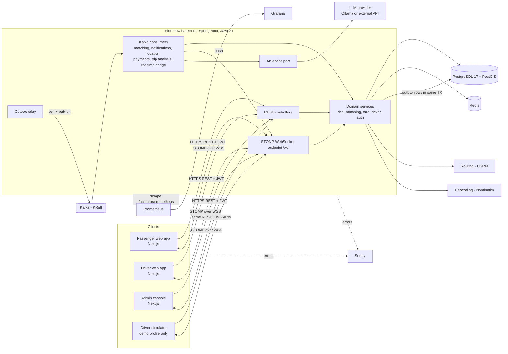
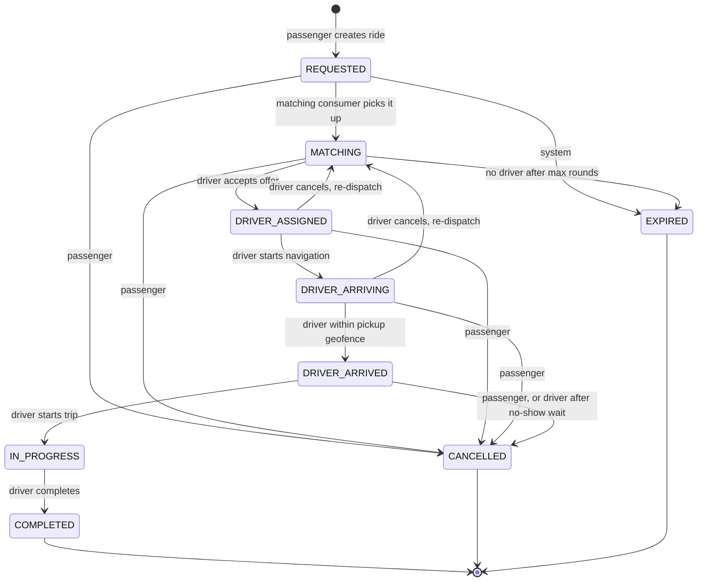
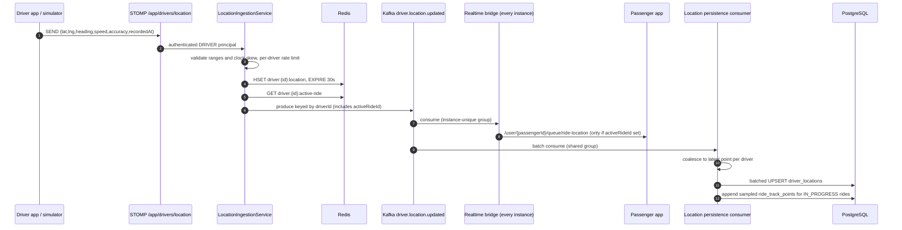
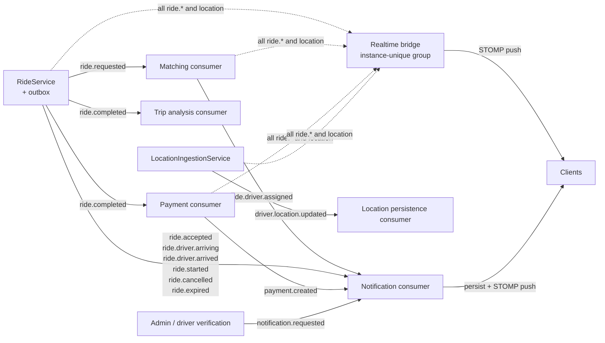
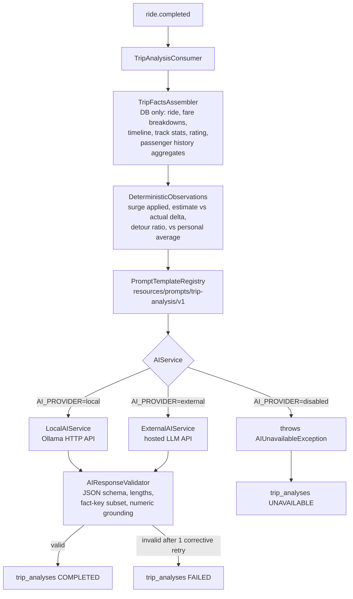
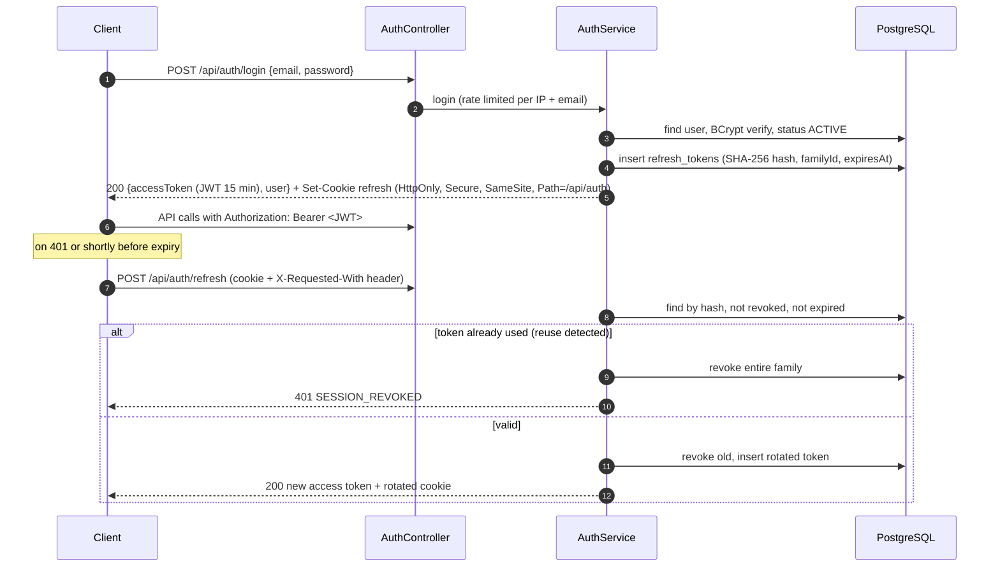
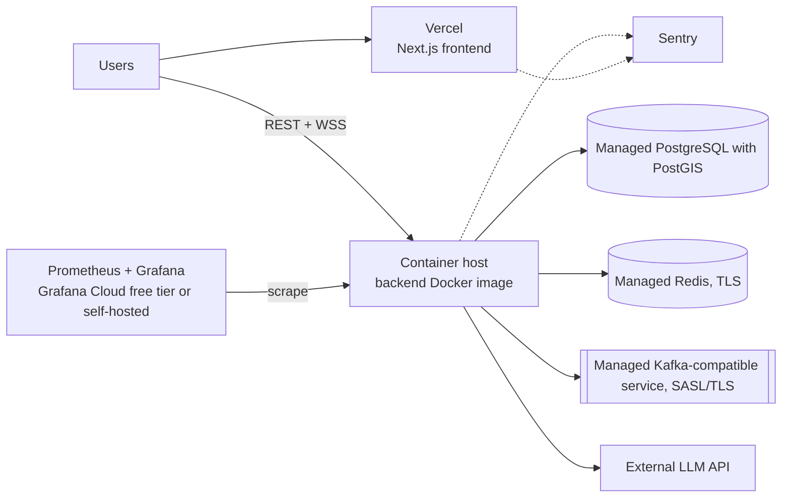
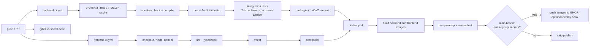

# RideFlow — Architecture

> Status: **Phase 1 (design)**. This document is the source of truth for architectural decisions.
> Detailed contracts live in companion documents:
>
> - [database.md](database.md) — schema, constraints, indexes, PostGIS queries
> - [api.md](api.md) — REST contracts, error model, pagination
> - [events.md](events.md) — Kafka topics, event schemas, WebSocket channels
> - [implementation-plan.md](implementation-plan.md) — phased delivery plan and definition of done

---

## 1. Product overview

RideFlow is a real-time ride-hailing platform with three roles:

| Role | Core journey |
|---|---|
| **Passenger** | Sign in → choose pickup/destination → see backend-calculated fare quotes → request → watch matching → track driver live → ride → pay → rate → AI Trip Intelligence |
| **Driver** | Sign in → onboarding (licence + vehicle) → admin verification → go online → stream location → receive offer → accept/reject → navigate → arrive → start → complete → earnings |
| **Admin** | Overview → users → driver verification → rides → system health → analytics |

Everything dynamic on screen is sourced from PostgreSQL, Redis, Kafka-driven WebSocket pushes, or computed by the backend. Demo seed data is isolated in a separate Flyway location that is only enabled under the `demo` profile (see §19).

---

## 2. Architectural style

**A modular monolith (one Spring Boot deployable) + asynchronous event processing through Kafka.**

Why not microservices: the domain has one consistency-critical aggregate (the ride) whose state transitions, driver availability and offers must change atomically. Splitting these across services would require distributed transactions or sagas for no portfolio-scale benefit. Instead, the monolith is split into internal modules with strict dependency rules (enforced by ArchUnit tests), and **Kafka provides the asynchronous seams** where work genuinely should not block a request: driver matching, notifications, location persistence, payments, AI analysis. Any of those consumers could later be extracted into its own service without changing producers.

### 2.1 Key decisions (ADR summary)

| # | Decision | Alternatives considered | Why |
|---|---|---|---|
| D1 | Modular monolith | Microservices | One engineer can explain and operate it; ride consistency stays in one DB transaction. |
| D2 | PostgreSQL + PostGIS as system of record | MongoDB geo, Redis GEO only | Relational integrity for rides/payments + index-backed spatial queries that can **join** spatial filters with relational filters (verification, availability, vehicle category). |
| D3 | Flyway migrations, `ddl-auto=validate` | Hibernate auto-DDL | Schema is reviewed, versioned SQL; Hibernate only validates that entities match. |
| D4 | Hot location path = WebSocket → Redis → Kafka; PostgreSQL is written by a **batched consumer** | Write every GPS ping to PostgreSQL | GPS updates are high-frequency and only the latest value matters. Coalescing in a batch consumer turns N writes/driver/interval into 1 upsert. |
| D5 | Transactional outbox for domain events | `kafkaTemplate.send()` inside the service; after-commit listener | Avoids the dual-write problem: an event is published **iff** the DB transaction committed, even across crashes. |
| D6 | Per-event-type Kafka topics, keyed by `rideId`/`driverId`, events carry `aggregateVersion` | Single `ride.events` topic | Matches the domain vocabulary and lets consumers subscribe narrowly; consumers use `aggregateVersion` to discard out-of-order updates. |
| D7 | Realtime bridge consumes Kafka with an **instance-unique consumer group** and pushes to the local STOMP broker | Direct in-process push; RabbitMQ STOMP relay | Every backend instance receives every event, so a passenger connected to instance B still gets updates caused on instance A. No extra broker. |
| D8 | JWT access tokens (15 min) + rotating opaque refresh tokens (hashed in PostgreSQL) | Server sessions; long-lived JWTs | Stateless API + WebSocket auth, with real revocation and reuse detection via refresh-token families. |
| D9 | Spring Security OAuth2 Resource Server for JWT validation | Hand-written JWT filter | Less custom security code; standard, well-tested validation. |
| D10 | Enums stored as `varchar` + `CHECK` constraints | PostgreSQL `ENUM` types | Adding a value is a simple constraint change inside a normal migration. |
| D11 | Optimistic locking (`@Version`) on `rides` + partial unique indexes | Pessimistic row locks everywhere | Two drivers accepting simultaneously → exactly one wins, the other gets `409`. DB indexes are the final backstop for "one active ride per passenger/driver". |
| D12 | AI behind `AIService` port with local (Ollama) and external implementations | Direct SDK calls from ride code | Provider-agnostic; AI failures are isolated from the ride lifecycle. |
| D13 | Map/routing/geocoding behind provider interfaces (MapLibre + OpenFreeMap, OSRM, Nominatim) | Google Maps SDK | No API key required for development; each provider replaceable via configuration. |
| D14 | Kafka in **KRaft** mode | ZooKeeper | ZooKeeper was removed in Kafka 4.x; one fewer container. |
| D15 | JSON event payloads with explicit `schemaVersion`, additive-only evolution | Avro + Schema Registry | Adequate for a single producer codebase; Schema Registry is listed as a future improvement. |
| D16 | Fare quotes are **HMAC-signed tokens** (`base64url(json).base64url(hmac)`), bound to the passenger, with expiry | Quote rows in Redis | No storage, survives restarts, works across instances, tamper-proof. The key is derived from the JWT secret with a distinct label, so a quote can never be replayed as an access token. Double booking is already prevented by `ux_rides_passenger_active`. *(Changed in Phase 3.)* |
| D17 | "One pending offer per driver" is a **partial unique index** (`ride_offers(driver_id) WHERE status='PENDING'`) with `INSERT … ON CONFLICT DO NOTHING` | Redis `SET NX` lock | Atomic with the offer insert, no second system that can disagree with the database. *(Changed in Phase 3.)* |
| D18 | Rides store `lat`/`lng`; PostGIS **generated columns** derive `geography` from them | Hibernate Spatial / JTS mapping | Entities stay plain Java while every spatial query and GiST index still uses real PostGIS geography. |
| D19 | **Lock ordering:** every transaction that mutates a ride locks the ride row (`SELECT … FOR UPDATE`) before touching its offers | Optimistic locking alone | Concurrent accept, cancel and matching serialise per ride and cannot deadlock; the optimistic `@Version` stays as a backstop. |
| D20 | Pushes go to **per-user queues** (`/user/queue/rides`, `/ride-location`, `/ride-offers`), with recipients computed by the server when it sends | Per-ride topics (`/topic/rides/{id}/…`) authorised at SUBSCRIBE time against a Redis participants key | A subscription authorised once stays open when access changes. A driver who withdraws from a ride would keep receiving its updates, including the next driver's details. Computing recipients from current data closes that gap and removes a cache that must be kept in step with the database. Cost: the payload names its `rideId`, and a user with several sessions receives the update on each, which is what a user with two tabs needs anyway. *(Changed in Phase 4.)* |
| D21 | **A socket lives no longer than its access token:** frames are refused after `exp`, and the server closes the socket (code 4001) | Validate only at CONNECT | Access tokens are short-lived because they cannot be revoked. A socket that outlived its token would turn a 15-minute credential into an unlimited one for everything pushed to it, such as live driver positions. Clients already refresh the token before reconnecting. *(Added in Phase 4.)* |

---

## 3. System architecture



---

## 4. Backend structure

Top-level packages follow the requested layered structure; inside `service`, code is grouped by feature so no package becomes a dumping ground.

```
backend/src/main/java/com/rideflow/
├── RideFlowApplication.java
├── config/          # Security, Jackson, Kafka, Redis, WebSocket, OpenAPI, CORS, properties binding
├── controller/      # Thin REST controllers: validate DTO → call service → map response
├── service/
│   ├── auth/        # registration, login, refresh-token rotation
│   ├── user/
│   ├── driver/      # onboarding, verification, availability
│   ├── ride/        # RideService, RideStateMachine, RideQueryService
│   ├── matching/    # DriverMatchingService, OfferService, MatchingSweeper
│   ├── fare/        # FareCalculator, SurgeService, FareQuoteService
│   ├── location/    # LocationIngestionService, LocationPersistenceService
│   ├── payment/     # PaymentService, PaymentGateway port
│   ├── rating/
│   ├── notification/
│   ├── analytics/   # admin overview / time series (read-only queries)
│   └── audit/
├── repository/      # Spring Data JPA repositories + native PostGIS queries
├── entity/          # JPA entities + enums
├── dto/             # request/response records (never entities over the wire)
├── mapper/          # MapStruct mappers entity ↔ DTO
├── security/        # JWT issuing, refresh tokens, principal
├── exception/       # domain exceptions + GlobalExceptionHandler + ApiError
├── websocket/       # STOMP auth + authorisation interceptors, message handlers, pushes, session registry
├── kafka/
│   ├── event/       # event envelope + payload records
│   ├── outbox/      # OutboxWriter, OutboxRelay
│   └── consumer/    # thin listeners delegating to services
├── geospatial/      # GeoPoint value object, RoutingProvider, GeocodingProvider, PostGIS helpers
├── cache/           # Redis key registry, rate limiter, typed cache helpers
├── ai/              # AIService, LocalAIService, ExternalAIService, prompts, validators, TripFactsAssembler
├── monitoring/      # custom Micrometer metrics, Sentry scrubbing
└── utility/         # small pure helpers (clock, money rounding)
```

**Dependency rules** (checked by ArchUnit in CI):

- `controller` → `service`, `dto` only (never `repository` or `entity`).
- `kafka.consumer` and `websocket` → `service` only.
- `entity` depends on nothing application-specific.
- Services own transactions (`@Transactional` at service method level, never on controllers).

---

## 5. Domain model


**Invariants enforced in code and in the database:**

1. A passenger has at most one active ride; a driver has at most one active ride (partial unique indexes).
2. Ride status only changes through `RideStateMachine` (§6); every change writes a `ride_status_events` row and an outbox event in the same transaction.
3. A driver can only go online when `verification_status = VERIFIED` and they have an active vehicle.
4. A driver holds at most one pending offer at a time (Redis `SET NX` lock + DB offer state).
5. Money is `numeric(10,2)` / `BigDecimal`, never floating point.
6. Fares are snapshotted (`fare_breakdowns`) so historical rides remain explainable even if pricing config changes.

A separate passenger-profile table is intentionally **omitted**: passengers have no attributes beyond `users` today. Drivers use a shared primary key (`drivers.id = users.id`), so `driverId == userId` everywhere (JWT subject, WebSocket user, APIs).

---

## 6. Ride state machine



Implementation: `RideStateMachine` holds an immutable `EnumMap<RideStatus, Map<RideStatus, Set<ActorType>>>`. `transition(ride, target, actor, reason)` throws `InvalidRideTransitionException` (HTTP 409, code `RIDE_INVALID_TRANSITION`) if the edge or actor is not allowed. It is the **only** code path that mutates `ride.status`; the entity setter is package-private. Guards that need data (e.g. the pickup geofence radius, no-show wait time) are configuration properties checked by `RideService` before calling the state machine.

---

## 7. Geospatial driver matching

### 7.1 Why PostGIS

The candidate search combines a spatial predicate ("within R metres") with relational predicates (verified, available, category, recently seen) and must sort by true distance. PostGIS evaluates all of it in one index-assisted query close to the data. Loading all drivers into Java would be O(n) per request and transfer every row over the network. Redis GEO is fast but cannot join against verification/vehicle data without a second round trip per candidate and gives no transactional consistency with driver availability.

### 7.2 Core query

```sql
SELECT d.id                                         AS driver_id,
       v.id                                         AS vehicle_id,
       ST_Distance(dl.location, :pickup)            AS distance_m
FROM   driver_locations dl
JOIN   drivers  d ON d.id = dl.driver_id
JOIN   vehicles v ON v.driver_id = d.id AND v.active
WHERE  d.availability        = 'AVAILABLE'
  AND  d.verification_status = 'VERIFIED'
  AND  v.category            = :category
  AND  dl.updated_at         > now() - make_interval(secs => :freshnessSeconds)
  AND  ST_DWithin(dl.location, :pickup, :radiusMeters)   -- GiST index
ORDER  BY dl.location <-> :pickup                          -- KNN via GiST
LIMIT  :candidateLimit;
-- :pickup = ST_SetSRID(ST_MakePoint(:lng, :lat), 4326)::geography   (longitude first!)
```

- `geography(Point, 4326)` gives distances in metres on the spheroid without manual projection.
- `ST_DWithin` on geography uses the GiST index `ix_driver_locations_location`; `<->` gives index-ordered nearest-neighbour.
- `NearbyDriverQueryIT` verifies radius, ordering, true distances, freshness, category and eligibility filters against real PostGIS, and asserts that `EXPLAIN` of the proximity query uses `ix_driver_locations_location`. Implementation: `DriverLocationRepository.findAvailableNear`.

### 7.3 Matching flow


Tunables (`rideflow.matching.*`): initial radius 3 km, growth factor 1.5 (3 km, 4.5 km, 6.75 km), max radius 8 km, max rounds 3, candidate limit 10, offers per round 3, offer TTL 20 s, location freshness 30 s. Sending up to three concurrent offers reduces passenger wait; the first accept wins (serialised on the ride row lock) and the others get `409 RIDE_ALREADY_ASSIGNED`.

State lives entirely in PostgreSQL, so matching is restart-safe: if the after-commit trigger is lost, the sweeper picks the ride up. Every instance can run the sweeper, because `runNextRound` locks the ride and re-checks every precondition. A driver who withdraws before pickup puts the ride back into `MATCHING` from round one, and is never re-offered the same ride (`UNIQUE (ride_id, driver_id)`).

*Phase 3 status:* the trigger is an in-process `@TransactionalEventListener(AFTER_COMMIT)` + `@Async` behind the `DomainEventPublisher` port. Phase 6 replaces the adapter with the transactional outbox and Kafka `ride.requested`; the matching service is unchanged.

---

## 8. Real-time location pipeline

*Current path (Phase 4):* `STOMP /app/drivers/location` (or `POST /api/drivers/location`) → `DriverLocationService` validates, conditionally upserts `driver_locations`, samples `ride_track_points` during a trip, and, while the driver is assigned to a ride, publishes `DriverLocationUpdatedEvent`. After commit, `RealtimePublisher` pushes it to that ride's passenger on `/user/queue/ride-location`. The diagram below is the target path once Redis (Phase 5) and Kafka (Phase 6) take over the hot path; the validation rules and the client contract stay the same.



**Design points**

- **No polling.** Passengers receive pushes over STOMP. REST `GET /api/rides/{id}/tracking` exists only for the initial snapshot after load/reconnect.
- **No per-ping PostgreSQL writes.** The hot path touches Redis and Kafka only; PostgreSQL receives one upsert per driver per consumer batch, plus track points sampled at ≥ 10 s or ≥ 25 m.
- **Privacy.** A driver's location is only ever pushed to the passenger of their active ride. Passengers browsing the map see nearby-car positions rounded to ~100 m, without identity.
- **Connection lifecycle.**
  - *Connect:* the access token in the STOMP `CONNECT` frame, validated by `StompAuthenticationInterceptor`. An invalid or missing token gets an `ERROR` frame and the socket is closed. So is a socket that sends no `CONNECT` within 10 s.
  - *Token expiry:* frames after the token's `exp` are refused, and `WebSocketSessionRegistry` closes the socket with code 4001 (D21).
  - *Subscribe and send:* a deny-by-default allow-list (`StompAuthorizationInterceptor`): own `/user/queue/*` destinations for everyone, `/topic/admin/activity` for admins, and `SEND` only to `/app/drivers/location` by drivers. All pushes use per-user queues with recipients computed at send time (D20).
  - *Invalid messages:* validation and domain failures are sent to `/user/queue/errors` with an error code; the session stays open.
  - *Heartbeats:* STOMP 10 s/10 s. On disconnect a driver is not set offline; presence follows location freshness.
  - *Reconnect:* the client retries with exponential backoff and jitter (1 s → 30 s cap), refreshing the access token first. After reconnecting it re-fetches the snapshot (`GET /api/rides/active`, `/tracking`, `GET /api/drivers/me/offers`) and resubscribes (the *snapshot + stream* pattern). Ride updates carry `version`, so the client ignores stale ones.
  - *Stale locations:* the tracking snapshot reports `stale: true` when the driver's last position is older than 30 s, and the passenger UI shows "Location signal lost". Matching ignores drivers whose `updated_at` is older than the freshness window. `DriverPresenceSweeper` sets `AVAILABLE` drivers with no update for 2 min to `OFFLINE` and notifies them on `/user/queue/presence`; drivers on a trip are never taken offline.

**Scaling note:** the realtime bridge's instance-unique consumer group means every instance receives all location events. That is fine up to thousands of concurrent rides. Beyond that, the next step is partition-aware routing or a dedicated realtime gateway (documented as a future improvement, not built).

---

## 9. Redis strategy

Redis holds **ephemeral, high-frequency or recomputable** state only. PostgreSQL remains the source of truth for anything durable. Rides are deliberately **not** cached: they change often and must be strongly consistent.

| Key pattern | Type | TTL | Purpose | Invalidation |
|---|---|---|---|---|
| `driver:{id}:location` | hash | 30 s | Latest position for tracking snapshot, arrival geofence, ETA | Overwritten on each update; expiry = stale |
| `driver:{id}:active-ride` | string | 12 h safety | Hot-path lookup when routing a location to a ride | Set on accept; deleted on complete/cancel/re-dispatch (after commit) |
| `ride:{id}:eta` | string | 30 s | Throttles routed ETA recomputation during pickup | Expiry |
| `route:{sha1(from,to,profile)}` | string (JSON) | 15 min | Caches routing-provider responses (slow, rate-limited external call) | Expiry |
| `geocode:{sha1(query)}` | string (JSON) | 24 h | Nominatim usage policy requires caching; cuts latency | Expiry |
| `surge:{geohash6}` | string | 60 s | Surge multiplier per ~1 km cell; the demand/supply counts are PostGIS queries | Expiry (short enough to track demand) |
| `rl:{scope}:{subject}:{window}` | counter | window length | Fixed-window rate limiting through an atomic Lua `INCR` + `EXPIRE` | Expiry |

Rate-limit scopes: login (5/min per IP + email), register (3/min per IP), ride creation (5/min per user), fare estimate (30/min per user), AI questions (10/hour per user). Location messages are throttled per WebSocket session in memory (≥ 1 s interval) because each driver has a single session.

Redis failure behaviour: rate limiting fails **open** (logged and counted in a metric). Tracking snapshots degrade to "unavailable". (Offer exclusivity and fare quotes deliberately do not depend on Redis; see D16 and D17. WebSocket authorisation needs no participants cache; see D20.)

Phase 5 will measure fare-estimate and geocoding latency with and without the cache using k6, and record the real numbers here.

---

## 10. Kafka architecture

Full topic and schema catalogue: [events.md](events.md).



**Where Kafka is used, and where it is not**

- ✅ Matching: decouples the passenger's `POST /rides` (fast `201`) from a multi-step search and offer process.
- ✅ Payments, AI analysis, notifications: side effects of completion that must not slow or fail the driver's "complete" request.
- ✅ Location: absorbs high-frequency writes and feeds both batch persistence and fan-out.
- ❌ Accept, start, complete, fare estimate, login: the caller needs the result immediately, so these are synchronous REST calls.

**Reliability**

- Producer: transactional outbox → `OutboxRelay` polls unpublished rows (`FOR UPDATE SKIP LOCKED`, batch 100, every 250 ms) and sends with `acks=all`, `enable.idempotence=true`. It marks a row published only after the broker acknowledges it.
- Consumer: at-least-once delivery. Handlers with side effects are idempotent through `processed_events(consumer, event_id)` inserts in the same transaction, or through natural idempotency (state checks).
- Errors: `DefaultErrorHandler` with exponential backoff (3 attempts), then `DeadLetterPublishingRecoverer` to `<topic>.DLT`. DLT depth is exposed as a metric and shown on the admin system page.
- Ordering: messages are keyed by `rideId` (ride topics) or `driverId` (location), so per-entity order is preserved within a topic. Cross-topic ordering is handled with `aggregateVersion`.

---

## 11. Fare calculation

`FareCalculator` is a pure, deterministic component (fully unit-tested). Pricing comes from `rideflow.pricing.*` configuration per vehicle category and currency. Nothing is hardcoded in code paths.

```
distanceCharge = perKm      × distanceKm
timeCharge     = perMinute  × durationMin
subtotal       = baseFare + distanceCharge + timeCharge
surged         = subtotal × surgeMultiplier            (multiplier locked at quote time)
total          = max(minimumFare, surged + bookingFee), rounded per currency rules (HALF_UP)
```

- **Estimate:** distance and duration come from `RoutingProvider` (OSRM). If routing is unavailable, `StraightLineRoutingProvider` uses haversine × configurable circuity factor and average speed, and the response is flagged `estimateSource: "APPROXIMATE"` so the UI can say so.
- **Surge:** in the ~1 km geohash cell around the pickup, `demand` = open ride requests in the last 10 min and `supply` = fresh available drivers (both PostGIS counts). Multiplier = `clamp(1 + sensitivity × max(0, demand/max(supply,1) − threshold), 1.0, maxSurge)`, rounded to 0.1 and cached 60 s.
- **Final fare:** at completion, actual distance = `ST_Length(ST_MakeLine(track points ORDER BY recorded_at))` and actual duration = `completed_at − started_at`. The same calculator runs with the surge locked at quote time. If too few track points exist, the routed distance is used and `distance_source` records that.
- The response returns: `estimatedFare`, `minimumFare`, `distanceMeters`, `durationSeconds`, `surgeMultiplier`, `estimateSource`, and a line-item `breakdown`.

---

## 12. AI Trip Intelligence

### 12.1 Architecture



### 12.2 Contract

```java
public interface AIService {
    TripInsights analyzeTrip(TripFacts facts);                       // after completion
    TripAnswer   answerQuestion(TripFacts facts, String question);   // "why was this ride more expensive?"
    AIProviderInfo providerInfo();                                   // provider + model, persisted with results
}
```

### 12.3 Grounding and guardrails

- **Facts only from the database.** `TripFacts` is a flat, keyed structure (`fare.final.total`, `distance.actualMeters`, `history.avgFarePerKm`, …). The exact facts JSON sent is persisted in `trip_analyses.facts` for auditability.
- **History comparison only with enough data.** History aggregates are included only when the passenger has ≥ 3 prior completed rides. Otherwise the prompt states that no comparison is possible.
- **Structured output.** The model must return JSON: `summary`, `fareExplanation`, `observations[]`, `recommendations[]`, `comparison|null`, `factKeysUsed[]`.
- **Validation.** Parse → Bean Validation (lengths, counts) → `factKeysUsed ⊆ provided keys` → every number appearing in text must match a supplied fact value (± 1 % tolerance, currency- and unit-aware). On failure, one corrective retry, then `FAILED(INVALID_RESPONSE)`.
- **Prompt injection.** User questions are placed in a delimited data block. The system prompt forbids following instructions inside it and allows `answerable: false` for off-topic questions.
- **Privacy.** No names, emails, phone numbers or raw coordinates go to the provider, only locality-level address labels and numeric trip facts.
- **Deterministic observations are shown regardless of AI status.** They are computed facts, labelled as such, not AI output.

### 12.4 Failure handling

| Failure | Mechanism | Result |
|---|---|---|
| Timeout | HTTP client connect/read timeouts + Resilience4j `TimeLimiter` | `FAILED(TIMEOUT)`, retryable by user |
| 5xx / network | Resilience4j `Retry` (2 attempts, exponential backoff) | `FAILED(PROVIDER_ERROR)` |
| 429 rate limit | Honour `Retry-After` once, then fail | `FAILED(RATE_LIMITED)` |
| Repeated failures | Resilience4j `CircuitBreaker` (opens at 50 % over 20 calls, 60 s) | `UNAVAILABLE` without calling provider |
| Provider disabled / no key | `AI_PROVIDER=disabled` | `UNAVAILABLE` |
| Invalid output | `AIResponseValidator` | `FAILED(INVALID_RESPONSE)` |
| Concurrency | Resilience4j `Bulkhead` (max 4 concurrent) | queued / rejected → `FAILED(BUSY)` |

The ride lifecycle never depends on AI. Analysis is a separate consumer group on `ride.completed`, so failures there cannot roll back or delay completion.

---

## 13. Security

### 13.1 Authentication flow



- JWT: HS256, secret from `JWT_SECRET` (≥ 256-bit), claims `sub` (userId), `role`, `iat`, `exp`, `jti`. Issued with `NimbusJwtEncoder`, validated by Spring Security's resource server.
- Passwords: `DelegatingPasswordEncoder` with BCrypt (strength 12).
- The access token lives in memory on the client, never in `localStorage`.

### 13.2 Authorisation

- **Role level:** `SecurityFilterChain` path rules plus `@PreAuthorize` on services where it reads more clearly.
- **Resource level (in services):** passengers see only their own rides, drivers only rides they are assigned or offered, admins everything. Resources a caller cannot see return **404** to avoid ID enumeration.
- **ADMIN accounts cannot be self-registered.** They are created by seed (demo) or a CLI bootstrap command using env-provided credentials.

### 13.3 Hardening checklist

CORS allow-list from `CORS_ALLOWED_ORIGINS` · security headers (HSTS in prod, `X-Content-Type-Options`, `Referrer-Policy`, `frame-ancestors 'none'`) · Bean Validation on every request DTO · only parameterised JPA/native queries · sort-field allow-list for pagination · Redis rate limiting · Actuator exposing only `health`, `info`, `prometheus` on a separate management port · secrets only from environment · gitleaks secret scan in CI · stack traces never serialised (§14) · PII scrubbed from logs and Sentry events.

---

## 14. Error handling

All errors go through `GlobalExceptionHandler` (`@RestControllerAdvice`) and return a single shape:

```json
{
  "timestamp": "2026-09-24T10:15:30.123Z",
  "status": 409,
  "error": "CONFLICT",
  "code": "RIDE_INVALID_TRANSITION",
  "message": "Ride cannot move from COMPLETED to REQUESTED",
  "path": "/api/rides/5b0c…/start",
  "traceId": "4bf92f3577b34da6",
  "fieldErrors": []
}
```

The mandated fields are extended with `code` (stable, machine-readable), `traceId` (links to logs and Sentry) and `fieldErrors` (validation). Domain exceptions extend `RideFlowException(code, httpStatus, message)`. Unknown exceptions are logged with the stack trace server-side, reported to Sentry, and returned as a generic 500 message. Exceptions are never swallowed. STOMP errors use the same `code` vocabulary on `/user/queue/errors`.

---

## 15. Observability

Logs, metrics and errors are three separate signals:

| Signal | Tool | Answers | Content |
|---|---|---|---|
| **Logs** | Structured JSON logs (Spring Boot structured logging) → stdout | *What happened in this request?* | Event-level context, `traceId`/`spanId` in MDC, no PII (emails masked, no tokens, no coordinates at INFO) |
| **Metrics** | Micrometer → `/actuator/prometheus` → Prometheus → Grafana | *How is the system behaving over time?* | Aggregated numbers |
| **Errors / traces** | Sentry (backend `sentry-spring-boot` starter, frontend `@sentry/nextjs`) | *What broke, for whom, how often, with which stack?* | Unhandled exceptions, 5xx, failed consumers; `sendDefaultPii=false` + `beforeSend` scrubber |

**Metrics (all real, emitted by the running application):**

- HTTP: `http_server_requests_seconds` (count, latency histogram, status → error rate), auto-instrumented.
- JVM / CPU / GC / threads, Hikari pool (`hikaricp_connections_*`), Lettuce Redis command latency, Kafka client and consumer-lag metrics, all through Micrometer binders.
- Custom (`monitoring/RideFlowMetrics`): `rideflow_rides_total{event}`, `rideflow_matching_duration_seconds` (requested → assigned), `rideflow_offers_total{outcome}`, `rideflow_ws_sessions_active{role}`, `rideflow_location_updates_total{result}`, `rideflow_outbox_pending`, `rideflow_dlt_messages_total{topic}`, `rideflow_ai_requests_total{provider,outcome}`, `rideflow_ai_latency_seconds`, `rideflow_rate_limit_rejections_total{scope}`.

**Grafana (provisioned from `infrastructure/grafana/`):**

1. *Service overview*: RED (rate, errors, duration p50/p95/p99), JVM, CPU, Hikari.
2. *Ride pipeline*: ride funnel, matching latency, offer acceptance rate, outbox backlog, consumer lag, DLT.
3. *Real-time & cache*: WebSocket sessions, location update throughput, Redis latency, rate-limit rejections.
4. *AI*: request outcomes, latency, circuit-breaker state.

---

## 16. Testing strategy

| Layer | Tooling | Examples |
|---|---|---|
| Unit | JUnit 5, Mockito, AssertJ | `FareCalculator`, `RideStateMachine` (every legal and illegal edge), surge formula, `AIResponseValidator`, prompt rendering, refresh rotation |
| Architecture | ArchUnit | controllers never touch repositories or entities; consumers delegate to services |
| Web slice | `@WebMvcTest` + Spring Security test | status codes, validation errors, role access, error shape |
| Persistence | `@DataJpaTest` + Testcontainers `postgis/postgis` | nearby-driver query correctness and ordering, freshness filter, partial unique indexes, track-point distance |
| Integration | `@SpringBootTest` + Testcontainers (PostGIS, Redis, Kafka) | outbox → Kafka → consumer; DLT routing; concurrent accept race (exactly one winner); Redis TTL and rate limits |
| End-to-end workflow | same + STOMP test client | passenger requests → `ride.requested` → offer pushed → driver accepts → location pushed to passenger over WS → start → complete → payment + analysis rows |
| AI | WireMock | timeout, 429 with `Retry-After`, 500, malformed JSON, ungrounded numbers, circuit open → ride unaffected |
| Frontend | Vitest + Testing Library; Playwright smoke | forms, realtime hook reconnect logic; login → estimate → request against the compose stack |
| Load | k6 | §23 of requirements, results recorded only from real runs |

Coverage is reported by JaCoCo, with a gate on `service` packages in CI (threshold set once a real baseline exists).

---

## 17. Frontend architecture

- **Next.js (App Router) + TypeScript + Tailwind CSS.** Route groups: `(auth)`, `(passenger)` → `/ride`, `/trips`; `(driver)` → `/drive`, `/drive/earnings`, `/drive/onboarding`; `(admin)` → `/admin/*`; `/settings`.
- **Server state:** TanStack Query. **Forms:** react-hook-form + zod. **Toasts:** sonner. **Theme:** next-themes (light and dark).
- **API client:** TypeScript types generated from the backend OpenAPI spec (`openapi-typescript`) so contracts cannot drift. A fetch wrapper handles access tokens and single-flight refresh.
- **Realtime:** `@stomp/stompjs` wrapped in a `useRealtime()` provider with backoff, token refresh before reconnect, resubscribe, and snapshot refetch. Status updates are applied only if `aggregateVersion` is newer.
- **Map:** a `MapView` component abstraction over MapLibre GL (`react-map-gl/maplibre`), style URL from `NEXT_PUBLIC_MAP_STYLE_URL` (default OpenFreeMap). Replacing the provider only touches `components/map/`.
- **UX states:** skeletons for every async view, explicit empty states, error boundaries with retry, accessible forms (labels, focus management, `aria-live` for ride status changes).
- **Visual direction:** decided in Phase 8. An original identity, not a copy of any existing ride-hailing brand.

---

## 18. Maps, routing, geocoding

| Concern | Interface | Default implementation | Fallback / alternative |
|---|---|---|---|
| Tiles / rendering | `MapView` (frontend) | MapLibre GL + OpenFreeMap style (no key) | MapTiler / self-hosted tiles via env |
| Routing (distance, duration, polyline) | `RoutingProvider` | `OsrmRoutingProvider` (`ROUTING_BASE_URL`) | `StraightLineRoutingProvider` (explicitly flagged approximate) |
| Geocoding / search | `GeocodingProvider` | `NominatimGeocodingProvider` (backend-proxied, cached, identifying User-Agent, 1 req/s) | Pick point on map, browser geolocation |

The public OSRM and Nominatim instances are for light development use only; the deployment docs cover self-hosting or a commercial provider.

---

## 19. Demo mode and seed data

- **Seed data** lives in `backend/src/main/resources/db/seed/` and is added to `spring.flyway.locations` **only** when the `demo` profile is active. It contains demo accounts (1 admin, passengers, verified drivers with vehicles) and initial driver positions around a configurable city centre. It contains **no rides, trips, payments or analytics**: those are produced by actually running rides.
- **Driver simulator** (`simulator/`, TypeScript/Node, compose profile `demo`) logs in as seeded drivers through `POST /api/auth/login`, goes online through `POST /api/drivers/online`, streams location over the same STOMP destination as a real driver, auto-accepts offers through `POST /api/rides/{id}/accept`, and follows real routes from `RoutingProvider` (via a backend route endpoint) to the pickup, then the destination, calling `en-route`, `arrive`, `start` and `complete`. The passenger watches it move through the real WebSocket pipeline. It shares no code path with the frontend and has no backdoor into the backend.
- A `--trips N` mode drives N complete rides for seeded passengers so that trip history and AI comparisons have genuine data.

---

## 20. Deployment topology



All endpoints and credentials come from environment variables. There is no provider-specific code. Candidate free or low-cost services are listed in `docs/deployment.md` (Phase 14) with their availability verified at deploy time.

---

## 21. CI/CD



---

## 22. Technology rationale (interview notes)

| Technology | The problem it solves here |
|---|---|
| **Spring Boot** | Mature ecosystem for security, JPA, WebSocket, Kafka and metrics with consistent configuration and testing support; productive for one engineer. |
| **PostgreSQL** | ACID transactions for the ride/offer/driver state changes that must happen together; constraints and partial unique indexes enforce invariants in the database itself. |
| **PostGIS** | Index-backed "nearest available verified driver within R metres" in one query, plus trip distance from recorded points (`ST_Length`) and surge supply/demand counts. |
| **Redis** | Sub-millisecond ephemeral state (latest locations, offer locks, quotes), caching of slow external calls (routing, geocoding), and distributed rate limiting. |
| **Kafka** | Durable, ordered, replayable events that decouple the ride lifecycle from matching, payments, notifications, AI and location persistence, with DLTs for failures. |
| **WebSocket (STOMP)** | Server push for live location and status without polling; STOMP adds destinations, subscriptions and heartbeats on top of raw sockets. |
| **JWT** | Stateless authentication shared by REST and WebSocket; short-lived access tokens plus revocable rotating refresh tokens balance scalability and control. |
| **Docker / Compose** | One command reproduces the whole stack (PostGIS, Redis, Kafka, Prometheus, Grafana) identically on any machine and in CI. |
| **GitHub Actions** | Every change is compiled, linted, unit- and integration-tested (real containers) and image-built before merge. |
| **Prometheus** | Pull-based time-series collection of the application's own metrics; alerting-ready. |
| **Grafana** | Dashboards that turn those metrics into answers (is matching slow? are consumers lagging?). |
| **Sentry** | Grouped, deduplicated exceptions with stack traces and release tracking across backend and frontend, which logs alone cannot provide. |
| **k6** | Scriptable, reproducible load tests with thresholds on p95/p99 and error rate, runnable in CI. |
| **AI (LLM)** | Turns structured trip facts into a plain-language explanation ("why was this more expensive?"), which is hard to template well, while grounding checks stop it from inventing data. |

---

## 23. Non-goals and future improvements

Not built (explicitly out of scope): real card processing (the `PaymentGateway` port has a `CASH` implementation and a clearly labelled sandbox card implementation; Stripe test mode is a future adapter), SMS/email delivery, native mobile apps, multi-city pricing administration UI, pooled rides.

Future: Avro + Schema Registry, dedicated realtime gateway for very high fan-out, service-area polygons in PostGIS managed by admins, OpenTelemetry distributed tracing export, extraction of the matching module into a separate service if its scaling profile diverges.
