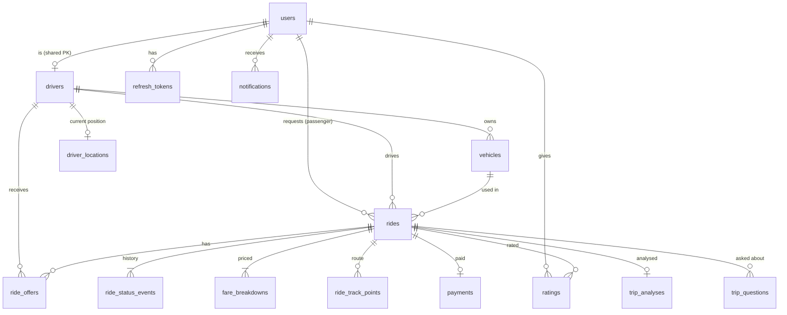

# RideFlow — Database Design

PostgreSQL 17 + PostGIS 3.5. Schema is managed by **Flyway** (`backend/src/main/resources/db/migration`); Hibernate runs with `ddl-auto=validate`. Demo seed data lives in a separate location (`db/seed`) enabled only by the `demo` profile.

Conventions:

- Primary keys `uuid DEFAULT gen_random_uuid()` (except high-volume append-only tables, which use `bigint GENERATED ALWAYS AS IDENTITY`).
- `created_at` / `updated_at timestamptz NOT NULL DEFAULT now()`; `updated_at` maintained by JPA auditing.
- Enumerations: `varchar` + `CHECK` (see architecture D10).
- Money: `numeric(10,2)`; currency `char(3)` (ISO 4217).
- Spatial: `geography(Point, 4326)`. **Longitude first** in `ST_MakePoint(lng, lat)`.
- `version bigint` for optimistic locking on contended rows.
- Extensions: `postgis`, `citext`, `pgcrypto` (for `gen_random_uuid` on older versions).

## ER diagram



## Tables

### users
| column | type | notes |
|---|---|---|
| id | uuid PK | |
| email | citext NOT NULL UNIQUE | case-insensitive uniqueness |
| phone | varchar(20) UNIQUE NULL | E.164 |
| password_hash | varchar(100) NOT NULL | BCrypt |
| full_name | varchar(120) NOT NULL | |
| role | varchar(16) NOT NULL | CHECK IN (PASSENGER, DRIVER, ADMIN) |
| status | varchar(16) NOT NULL DEFAULT 'ACTIVE' | CHECK IN (ACTIVE, SUSPENDED) |
| last_login_at | timestamptz NULL | |
| created_at, updated_at, version | | |

Indexes: `ix_users_role_status (role, status)` for admin filtering.

### refresh_tokens
| column | type | notes |
|---|---|---|
| id | uuid PK | |
| user_id | uuid NOT NULL FK users ON DELETE CASCADE | |
| token_hash | varchar(64) NOT NULL UNIQUE | SHA-256 hex of the opaque token |
| family_id | uuid NOT NULL | rotation chain; reuse → revoke family |
| expires_at | timestamptz NOT NULL | |
| revoked_at | timestamptz NULL | |
| replaced_by_id | uuid NULL FK refresh_tokens | |
| created_at | timestamptz | |

Indexes: `(user_id)`, `(family_id)`. A scheduled job deletes rows expired > 7 days.

### drivers
| column | type | notes |
|---|---|---|
| id | uuid PK, FK users(id) ON DELETE CASCADE | shared primary key |
| license_number | varchar(40) NOT NULL UNIQUE | |
| verification_status | varchar(16) NOT NULL DEFAULT 'PENDING' | CHECK IN (PENDING, VERIFIED, REJECTED, SUSPENDED) |
| verified_at | timestamptz NULL | |
| verified_by | uuid NULL FK users | admin |
| rejection_reason | varchar(255) NULL | |
| availability | varchar(16) NOT NULL DEFAULT 'OFFLINE' | CHECK IN (OFFLINE, AVAILABLE, ON_TRIP) |
| rating_avg | numeric(3,2) NULL | CHECK 1..5 |
| rating_count | integer NOT NULL DEFAULT 0 | |
| created_at, updated_at, version | | |

Constraint: `CHECK (availability = 'OFFLINE' OR verification_status = 'VERIFIED')`.
Indexes: `ix_drivers_available (id) WHERE availability = 'AVAILABLE' AND verification_status = 'VERIFIED'`.

### vehicles
| column | type | notes |
|---|---|---|
| id | uuid PK | |
| driver_id | uuid NOT NULL FK drivers | |
| make, model | varchar(40) NOT NULL | |
| color | varchar(30) NOT NULL | |
| plate_number | varchar(20) NOT NULL UNIQUE | normalised upper-case |
| model_year | smallint NOT NULL | CHECK 1990..(current+1) via app validation; CHECK >= 1990 in DB |
| category | varchar(16) NOT NULL | CHECK IN (ECONOMY, COMFORT, XL) |
| seats | smallint NOT NULL | CHECK 2..8 |
| active | boolean NOT NULL DEFAULT true | |
| created_at, updated_at | | |

Indexes: `ux_vehicles_one_active_per_driver UNIQUE (driver_id) WHERE active`.

### driver_locations  *(current position only — one row per driver)*
| column | type | notes |
|---|---|---|
| driver_id | uuid PK FK drivers ON DELETE CASCADE | |
| location | geography(Point,4326) NOT NULL | |
| heading_deg | smallint NULL | CHECK 0..359 |
| speed_mps | numeric(5,2) NULL | CHECK >= 0 |
| accuracy_m | numeric(6,1) NULL | |
| recorded_at | timestamptz NOT NULL | device time |
| updated_at | timestamptz NOT NULL | server time; used for freshness |

Indexes: `ix_driver_locations_location USING GIST (location)`, `ix_driver_locations_updated_at (updated_at)`.

Written only by the batched location consumer:

```sql
INSERT INTO driver_locations (driver_id, location, heading_deg, speed_mps, accuracy_m, recorded_at, updated_at)
VALUES (...), (...), ...                                   -- one row per driver per batch
ON CONFLICT (driver_id) DO UPDATE
SET location = EXCLUDED.location, heading_deg = EXCLUDED.heading_deg, speed_mps = EXCLUDED.speed_mps,
    accuracy_m = EXCLUDED.accuracy_m, recorded_at = EXCLUDED.recorded_at, updated_at = now()
WHERE driver_locations.recorded_at < EXCLUDED.recorded_at;   -- never regress to an older point
```

### rides
| column | type | notes |
|---|---|---|
| id | uuid PK | |
| passenger_id | uuid NOT NULL FK users | |
| driver_id | uuid NULL FK drivers | set on accept, cleared on re-dispatch |
| vehicle_id | uuid NULL FK vehicles | vehicle used for this ride |
| status | varchar(20) NOT NULL | CHECK IN (REQUESTED, MATCHING, DRIVER_ASSIGNED, DRIVER_ARRIVING, DRIVER_ARRIVED, IN_PROGRESS, COMPLETED, CANCELLED, EXPIRED) |
| vehicle_category | varchar(16) NOT NULL | |
| pickup_lat, pickup_lng | double precision NOT NULL | written by the application; range CHECKs |
| pickup_location | geography(Point,4326) **GENERATED ALWAYS AS** `ST_SetSRID(ST_MakePoint(pickup_lng, pickup_lat), 4326)::geography` STORED | used by spatial queries and indexes; never written by Hibernate |
| pickup_address | varchar(255) NOT NULL | display label |
| dropoff_lat, dropoff_lng, dropoff_location, dropoff_address | | same pattern as pickup |
| payment_method | varchar(16) NOT NULL | CHECK IN (CASH, CARD) |
| estimated_distance_m, estimated_duration_s | integer NOT NULL | CHECK > 0, from the fare quote |
| estimate_source | varchar(16) NOT NULL | CHECK IN (ROUTED, APPROXIMATE) |
| surge_multiplier | numeric(4,2) NOT NULL | locked at quote time; CHECK >= 1 |
| currency | varchar(3) NOT NULL | |
| actual_distance_m, actual_duration_s | integer NULL | set on completion |
| distance_source | varchar(16) NULL | CHECK IN (TRACKED, ESTIMATED) |
| matching_round | smallint NOT NULL DEFAULT 0 | |
| matching_radius_m | integer NOT NULL DEFAULT 0 | radius of the current round |
| round_started_at | timestamptz NULL | the sweeper advances rounds older than the offer TTL |
| requested_at | timestamptz NOT NULL | |
| accepted_at, en_route_at, arrived_at, started_at, completed_at, cancelled_at, expired_at | timestamptz NULL | |
| cancelled_by | varchar(16) NULL | CHECK IN (PASSENGER, DRIVER, SYSTEM, ADMIN) |
| cancellation_reason | varchar(255) NULL | |
| created_at, updated_at, version | | `version` = optimistic lock and realtime ordering |

Constraints:
- `CHECK (driver_id IS NOT NULL OR status IN ('REQUESTED','MATCHING','CANCELLED','EXPIRED'))`
- `CHECK (status <> 'COMPLETED' OR (completed_at, actual_distance_m, actual_duration_s all NOT NULL))`

Indexes:
- `ux_rides_passenger_active UNIQUE (passenger_id) WHERE status IN ('REQUESTED','MATCHING','DRIVER_ASSIGNED','DRIVER_ARRIVING','DRIVER_ARRIVED','IN_PROGRESS')`
- `ux_rides_driver_active UNIQUE (driver_id) WHERE status IN ('DRIVER_ASSIGNED','DRIVER_ARRIVING','DRIVER_ARRIVED','IN_PROGRESS')`
- `ix_rides_passenger_requested (passenger_id, requested_at DESC)`: trip history
- `ix_rides_driver_requested (driver_id, requested_at DESC)`: driver history and earnings
- `ix_rides_status_requested (status, requested_at)`: admin filters, sweeper
- `ix_rides_pickup_open USING GIST (pickup_location) WHERE status IN ('REQUESTED','MATCHING')`: surge demand count

### ride_offers
| column | type | notes |
|---|---|---|
| id | uuid PK | |
| ride_id | uuid NOT NULL FK rides ON DELETE CASCADE | |
| driver_id | uuid NOT NULL FK drivers | |
| round | smallint NOT NULL | matching round |
| distance_m | integer NOT NULL | driver to pickup at offer time |
| status | varchar(16) NOT NULL | CHECK IN (PENDING, ACCEPTED, REJECTED, EXPIRED, CANCELLED) |
| offered_at, expires_at | timestamptz NOT NULL | |
| responded_at | timestamptz NULL | |

Indexes:
- `UNIQUE (ride_id, driver_id)`: never re-offer the same ride to the same driver
- `ux_ride_offers_one_pending_per_driver UNIQUE (driver_id) WHERE status = 'PENDING'`: a driver holds at most one pending offer
- `ux_ride_offers_one_accepted_per_ride UNIQUE (ride_id) WHERE status = 'ACCEPTED'`
- `ix_ride_offers_pending_expiry (expires_at) WHERE status = 'PENDING'`, `ix_ride_offers_ride_status (ride_id, status)`

Offers are inserted with `INSERT … ON CONFLICT DO NOTHING`, so a race between two matching rounds that pick the same driver resolves inside the database (one insert wins, the other is skipped) instead of failing a transaction. A driver who withdraws after accepting has their offer set to `CANCELLED`, freeing the ride's single "accepted" slot.

### ride_status_events *(append-only)*
| column | type | notes |
|---|---|---|
| id | bigint identity PK | |
| ride_id | uuid NOT NULL FK rides ON DELETE CASCADE | |
| from_status | varchar(20) NULL | NULL for creation |
| to_status | varchar(20) NOT NULL | |
| actor_type | varchar(16) NOT NULL | PASSENGER, DRIVER, SYSTEM, ADMIN |
| actor_user_id | uuid NULL FK users | |
| reason | varchar(255) NULL | |
| ride_version | bigint NOT NULL | aggregate version after transition |
| occurred_at | timestamptz NOT NULL | |

Index: `(ride_id, occurred_at)`.

### fare_breakdowns
| column | type | notes |
|---|---|---|
| id | uuid PK | |
| ride_id | uuid NOT NULL FK rides ON DELETE CASCADE | |
| kind | varchar(10) NOT NULL | CHECK IN (ESTIMATE, FINAL) |
| base_fare, distance_charge, time_charge, subtotal, booking_fee, minimum_fare, total | numeric(10,2) NOT NULL | |
| surge_multiplier | numeric(4,2) NOT NULL | CHECK >= 1 |
| minimum_fare_applied | boolean NOT NULL | |
| currency | varchar(3) NOT NULL | |
| distance_m, duration_s | integer NOT NULL | inputs used |
| pricing_version | varchar(20) NOT NULL | `rideflow.pricing.version` at calculation time |
| created_at | timestamptz | |

Unique: `(ride_id, kind)`. The ESTIMATE row is copied from the signed quote; the FINAL row is recalculated on completion from measured distance and duration with the surge locked at booking.

### ride_track_points *(append-only, sampled while IN_PROGRESS)*
| column | type | notes |
|---|---|---|
| id | bigint identity PK | |
| ride_id | uuid NOT NULL FK rides ON DELETE CASCADE | |
| location | geography(Point,4326) NOT NULL | |
| recorded_at | timestamptz NOT NULL | |

Index: `(ride_id, recorded_at)`. Distance:

```sql
SELECT ST_Length(ST_MakeLine(location::geometry ORDER BY recorded_at)::geography)
FROM ride_track_points WHERE ride_id = :rideId;
```

Retention: points older than 90 days are purged by a scheduled job (the aggregate `actual_distance_m` is kept on the ride).

### payments
| column | type | notes |
|---|---|---|
| id | uuid PK | |
| ride_id | uuid NOT NULL UNIQUE FK rides | one payment per ride |
| amount | numeric(10,2) NOT NULL | CHECK >= 0 |
| currency | char(3) NOT NULL | |
| method | varchar(16) NOT NULL | CASH, CARD |
| status | varchar(16) NOT NULL | CHECK IN (PENDING, CAPTURED, FAILED, REFUNDED) |
| platform_fee | numeric(10,2) NOT NULL | commission (config %) |
| driver_earnings | numeric(10,2) NOT NULL | CHECK platform_fee + driver_earnings = amount |
| gateway | varchar(20) NOT NULL | CASH, SANDBOX, … |
| gateway_reference | varchar(80) NULL | |
| created_at, updated_at | | |

Index: `(status)`; earnings query joins `rides.driver_id`.

### ratings
| column | type | notes |
|---|---|---|
| id | uuid PK | |
| ride_id | uuid NOT NULL FK rides | |
| rater_id | uuid NOT NULL FK users | |
| ratee_id | uuid NOT NULL FK users | |
| score | smallint NOT NULL | CHECK 1..5 |
| comment | varchar(500) NULL | |
| created_at | timestamptz | |

Unique: `(ride_id, rater_id)`. Driver `rating_avg/rating_count` updated in the same transaction (incremental average under the driver row's optimistic lock).

### notifications
| column | type | notes |
|---|---|---|
| id | uuid PK | |
| user_id | uuid NOT NULL FK users ON DELETE CASCADE | |
| type | varchar(40) NOT NULL | e.g. RIDE_ACCEPTED, DRIVER_ARRIVED, DRIVER_VERIFIED |
| title | varchar(120) NOT NULL | |
| body | varchar(500) NOT NULL | |
| ride_id | uuid NULL FK rides | |
| source_event_id | uuid NULL UNIQUE | idempotency against Kafka redelivery |
| read_at | timestamptz NULL | |
| created_at | timestamptz | |

Indexes: `(user_id, created_at DESC)`, `ix_notifications_unread (user_id) WHERE read_at IS NULL`.

### trip_analyses
| column | type | notes |
|---|---|---|
| id | uuid PK | |
| ride_id | uuid NOT NULL UNIQUE FK rides | |
| status | varchar(16) NOT NULL | PENDING, COMPLETED, FAILED, UNAVAILABLE |
| failure_code | varchar(30) NULL | TIMEOUT, PROVIDER_ERROR, RATE_LIMITED, INVALID_RESPONSE, BUSY |
| provider | varchar(30) NULL | |
| model | varchar(80) NULL | |
| prompt_version | varchar(20) NOT NULL | |
| facts | jsonb NOT NULL | exact grounded input |
| observations | jsonb NOT NULL | deterministic, computed observations |
| result | jsonb NULL | validated AI output |
| latency_ms | integer NULL | |
| input_tokens, output_tokens | integer NULL | |
| attempts | smallint NOT NULL DEFAULT 0 | |
| created_at, updated_at | | |

### trip_questions
| column | type | notes |
|---|---|---|
| id | uuid PK | |
| ride_id | uuid NOT NULL FK rides | |
| user_id | uuid NOT NULL FK users | |
| question | varchar(500) NOT NULL | |
| status | varchar(16) NOT NULL | COMPLETED, FAILED, UNAVAILABLE |
| answer | jsonb NULL | |
| provider, model, prompt_version | varchar | |
| created_at | timestamptz | |

Index: `(ride_id, created_at)`.

### audit_logs *(append-only)*
| column | type | notes |
|---|---|---|
| id | bigint identity PK | |
| actor_user_id | uuid NULL FK users | NULL = system |
| action | varchar(64) NOT NULL | e.g. DRIVER_VERIFIED, USER_STATUS_CHANGED, LOGIN_FAILED |
| entity_type | varchar(40) NOT NULL | |
| entity_id | uuid NULL | |
| details | jsonb NULL | never contains passwords, tokens, or raw PII |
| created_at | timestamptz | |

Indexes: `(entity_type, entity_id)`, `(created_at DESC)`, `(actor_user_id, created_at DESC)`.

### outbox_events
| column | type | notes |
|---|---|---|
| id | uuid PK | = `eventId` in the envelope |
| topic | varchar(100) NOT NULL | |
| message_key | varchar(100) NOT NULL | rideId / driverId |
| event_type | varchar(60) NOT NULL | |
| payload | jsonb NOT NULL | full envelope |
| created_at | timestamptz NOT NULL | |
| published_at | timestamptz NULL | |
| attempts | integer NOT NULL DEFAULT 0 | |
| last_error | varchar(500) NULL | |

Index: `ix_outbox_unpublished (created_at) WHERE published_at IS NULL`. Published rows purged after 3 days.

> `driver.location.updated` is **not** written through the outbox: it is high-volume, ephemeral and loss-tolerant (the next ping supersedes it), so it is produced directly to Kafka from the ingestion path.

### processed_events
| column | type | notes |
|---|---|---|
| consumer | varchar(60) | PK part |
| event_id | uuid | PK part |
| processed_at | timestamptz NOT NULL | |

Purged after 7 days (longer than Kafka redelivery window).

## Query catalogue (PostGIS)

| Purpose | Query shape | Index used |
|---|---|---|
| Nearby candidate drivers | `ST_DWithin` + `ORDER BY <->` (architecture §7.2) | `ix_driver_locations_location` (GiST) |
| Nearby cars for passenger map | same, limited to 20, returns `ST_SnapToGrid` rounded points, no identity | GiST |
| Surge supply | `count(*)` fresh available drivers `ST_DWithin(…, 2000)` | GiST |
| Surge demand | `count(*)` rides `status IN (REQUESTED, MATCHING)` created last 10 min `ST_DWithin(pickup_location, …)` | `ix_rides_pickup_open` (partial GiST) |
| Trip actual distance | `ST_Length(ST_MakeLine(... ORDER BY recorded_at))` | `(ride_id, recorded_at)` |
| Detour ratio (AI fact) | actual distance / `ST_Distance(pickup, dropoff)` | — |

## Migration plan

Implemented: `V1__extensions.sql` → `V2__users_auth_audit.sql` (users, refresh_tokens, audit_logs) → `V3__drivers_vehicles_locations.sql` → `V4__rides_offers_fares.sql` (rides, ride_offers, ride_status_events, fare_breakdowns, ride_track_points). Planned: `V5__payments_ratings_notifications.sql` → `V6__ai.sql` → `V7__outbox_processed_events.sql`.

Seed: `db/seed/R__demo_seed.sql` (repeatable, `demo` profile only). Seed passwords are never committed: they are hashed inside PostgreSQL with pgcrypto `crypt()` from the `${demo_password}` Flyway placeholder, which comes from the `DEMO_USER_PASSWORD` environment variable.
