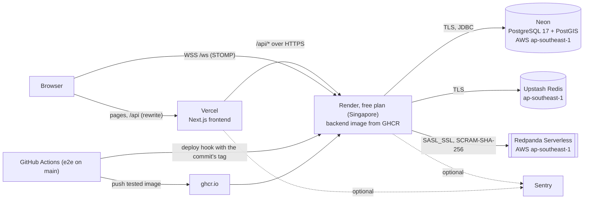

# Deployment

RideFlow runs publicly on free tiers: the Next.js frontend on Vercel, the backend container on Render, and
managed PostgreSQL with PostGIS (Neon), Redis (Upstash) and Kafka (Redpanda Serverless). The only
code-level difference from the compose stack is configuration: every endpoint and credential comes from
environment variables, and none is stored in Git.

- [Topology](#topology)
- [Services and their free-tier limits](#services-and-their-free-tier-limits)
- [Trade-offs of the free tiers](#trade-offs-of-the-free-tiers)
- [Setting it up](#setting-it-up)
- [Environment variables](#environment-variables)
- [Updates and rollback](#updates-and-rollback)
- [Running the driver simulator against the deployment](#running-the-driver-simulator-against-the-deployment)
- [Monitoring](#monitoring)
- [Security notes](#security-notes)
- [Measured](#measured)

## Topology



- **REST goes through Vercel.** The browser calls `/api` on the frontend's own origin and Next's rewrite
  forwards it to the backend, so the refresh-token cookie (HttpOnly, Secure, SameSite=Lax, Path=/api/auth)
  stays first-party and REST needs no CORS preflight.
- **The WebSocket goes straight to Render.** Vercel does not proxy WebSockets. The backend accepts the
  handshake only from the origins in `CORS_ALLOWED_ORIGINS`, and the STOMP CONNECT frame carries the access
  token.
- **Everything in one region.** Render's Singapore region is the nearest to the demo city (Hyderabad), and
  Neon, Upstash and Redpanda each offer AWS ap-southeast-1 (Singapore), so every backend call to
  infrastructure stays in the region.

## Services and their free-tier limits

Checked on 2026-09-25 on each provider's own pages; free tiers change, so check them again before relying on
these numbers.

| Role | Service | Free tier | Source |
|---|---|---|---|
| Frontend | Vercel Hobby | Non-commercial projects; builds from Git | [vercel.com/pricing](https://vercel.com/pricing) |
| Backend container | Render free web service | 512 MB, 0.1 CPU, 750 instance hours a month; spins down after 15 minutes without traffic and takes about a minute to start again | [render.com/docs/free](https://render.com/docs/free) |
| PostgreSQL + PostGIS | Neon Free | 100 CU-hours a month, 0.5 GB storage, PostGIS available; compute suspends when idle; over the limits it suspends rather than bills | [neon.com/faqs/free-plan-limits-and-quotas](https://neon.com/faqs/free-plan-limits-and-quotas) |
| Redis | Upstash Redis Free | 256 MB, 500,000 commands a month | [upstash.com/docs/redis/overall/pricing](https://upstash.com/docs/redis/overall/pricing) |
| Kafka | Redpanda Serverless | **A trial**: $100 of credit for 30 days, no card; then suspended, and deleted after a further 7 days unless a card is added. Replication factor 3, 5,000 partitions, 200 consumer groups | [docs.redpanda.com, Serverless](https://docs.redpanda.com/redpanda-cloud/get-started/cluster-types/serverless/) |

**Why Redpanda for Kafka:** RideFlow declares 16 topics, each with a dead-letter topic: 32 topics. Aiven's
free Kafka allows 5 topics of 2 partitions ([Aiven docs](https://aiven.io/docs/products/kafka/free-tier/kafka-free-tier)),
and Confluent Cloud's trial needs a card before anything is created
([Confluent docs](https://docs.confluent.io/cloud/current/get-started/free-trial.html)). Redpanda Serverless
speaks the Kafka protocol, needs no card for its trial, and runs in Singapore. No Kafka service found has a
permanent free tier that fits 32 topics.

## Trade-offs of the free tiers

- **Kafka is a 30-day trial.** After the credit or the 30 days run out, the cluster is suspended: rides can
  still be booked, but the outbox cannot publish, so matching, payments and notifications stop until Kafka
  is back (the outbox keeps every event and publishes it then). Keeping the deployment beyond 30 days means
  adding a card to Redpanda (pay per use), or moving to another Kafka service with the same four variables.
  Redpanda bills partition-hours, which is why the deployment uses one partition per topic
  (`KAFKA_PARTITIONS=1`: 32 partitions instead of 96). One partition per topic keeps per-key order and loses
  nothing here, because each consumer group runs one consumer per instance anyway.
- **The backend sleeps.** After 15 minutes without requests Render stops the instance. The next visitor
  waits for a cold start, and open WebSockets are dropped (the app reconnects). While the backend sleeps,
  nothing runs in the background: no matching sweeps, no presence sweeps, no outbox relay. On waking, they
  catch up from the database. The upside: a sleeping backend does not query Neon, so Neon can suspend too,
  which keeps it within its compute hours. The outbox relay polls every 250 ms while the backend is awake,
  which keeps Neon's compute (0.25 CU at the smallest size) awake for as long as the backend is: about
  0.08 CU-hours per 20 minutes awake, or around 1,200 separate visits a month within the 100 CU-hours.
- **Slow at 0.1 CPU.** Password hashing (BCrypt, strength 12) and the JVM's warm-up take roughly ten times
  longer than on a full core. The [free-tier-fit](#measured) numbers show how long login and a whole ride
  take at this size.
- **The Redis budget.** 500,000 commands a month is ample for visitors, but a driver simulator run writes
  each driver's position about every two seconds. Run it for a demo, not continuously. If the quota runs
  out, Redis calls fail and the backend fails open (caches miss, rate limits allow), as designed.
- **Consumer groups add up.** Each backend start joins Kafka with a new realtime consumer group (one per
  instance, so every instance sees every event). An idle group is removed after the broker's offset
  retention (7 days by default), so more than about 200 starts in 7 days would reach Redpanda's
  consumer-group limit.
- **No metrics scraping.** Render routes only the public port, and the actuator's port (with
  `/actuator/prometheus`) is not public by design, so the deployment has no Prometheus or Grafana. Errors
  still reach Sentry when `SENTRY_DSN` is set. Exposing metrics would mean putting them on the public port
  behind authentication, which the compose stack does not need.
- **Demo profile.** The deployment runs `prod,demo`: production logging and settings, plus the seeded demo
  accounts that the driver simulator uses. Their password is `DEMO_USER_PASSWORD`, set only in Render.
  Visitors register their own accounts.

## Setting it up

About 30 minutes. Each provider needs an account of your own, and every credential is entered only in that
provider's dashboard or in Render's.

### 1. PostgreSQL on Neon

1. Create a project: PostgreSQL 17, region **AWS Asia Pacific (Singapore)**.
2. From **Connect**, take the **direct** connection, not the pooled one (host without `-pooler`). Flyway
   and the JDBC driver's prepared statements expect a session, which the pooler's transaction mode does not
   keep.
3. Note three values:
   - `DATABASE_URL`: `jdbc:postgresql://<host>/<database>?sslmode=require`
   - `DATABASE_USERNAME`: the role
   - `DATABASE_PASSWORD`: its password

   The first start's migration creates the PostGIS, citext and pgcrypto extensions itself.

### 2. Redis on Upstash

1. Create a Redis database in **ap-southeast-1**, with TLS on (the default).
2. Note `REDIS_HOST` (the endpoint without a port) and `REDIS_PASSWORD` (the password or token). The port
   is 6379.

### 3. Kafka on Redpanda Serverless

1. Create a Serverless cluster on **AWS ap-southeast-1**.
2. Under **Security**, create a user with mechanism **SCRAM-SHA-256**. Use a password of letters and
   digits only: it is placed inside the client's JAAS line, where a quote or backslash would break it.
3. Give that user ACLs allowing all operations on topics and consumer groups (the backend creates its own
   topics at startup, since automatic topic creation is off), plus describe on the cluster.
4. Note `KAFKA_BOOTSTRAP_SERVERS` (from the cluster overview), `KAFKA_USERNAME` and `KAFKA_PASSWORD`.

### 4. Backend on Render

1. **New → Blueprint**, connect this repository. Render reads [`render.yaml`](../render.yaml) and asks
   for every value marked `sync: false`:
   - the database, Redis and Kafka values from steps 1–3
   - `CORS_ALLOWED_ORIGINS`: the Vercel URL from step 5. If you don't know it yet, enter
     `https://rideflow.vercel.app` or your chosen name and correct it after step 5.
   - `BOOTSTRAP_ADMIN_EMAIL` and `BOOTSTRAP_ADMIN_PASSWORD`: the first admin account, created at startup if
     no admin exists. The password needs 10–72 bytes with at least one letter and one digit, or the backend
     refuses to start.
   - `DEMO_USER_PASSWORD`: the seeded demo accounts' password, which the simulator uses
   - `SENTRY_DSN`: the backend project's DSN, or leave it empty for no error reporting

   `JWT_SECRET` is generated by Render. The image is `ghcr.io/saitharun1903/rideflow-backend:latest`,
   public, so Render needs no registry credentials.
2. Wait for the first deploy to report **Live**. The health check is `/readyz`. Open
   `https://<render-url>/readyz`: it answers `{"status":"UP"}`.
3. **Settings → Deploy Hook**: copy the URL. In GitHub, **Settings → Secrets and variables → Actions**,
   add it as the repository secret `RENDER_DEPLOY_HOOK_URL`. From then on, every commit on `main` that
   passes `e2e` is deployed by its commit tag.

### 5. Frontend on Vercel

1. **Add New → Project**, import this repository, set **Root Directory** to `frontend`. The framework
   preset is Next.js, and Node 24 comes from `package.json`.
2. Environment variables (Production):
   - `BACKEND_URL`: `https://<render-url>` (the /api rewrite target, fixed at build time)
   - `NEXT_PUBLIC_WS_URL`: `wss://<render-url>/ws`
   - optional: `NEXT_PUBLIC_SENTRY_DSN` (the frontend project's DSN) and
     `NEXT_PUBLIC_SENTRY_ENVIRONMENT=production`

   A Vercel build without an `https://` `BACKEND_URL` and a `wss://` `NEXT_PUBLIC_WS_URL` fails on purpose
   (`next.config.ts`), rather than building a site that calls localhost.
3. Deploy. If the production URL differs from what Render's `CORS_ALLOWED_ORIGINS` says, correct it there;
   Render restarts with the new value.

Preview deployments get other URLs, which the backend's origin check does not allow. Their pages load, but
signing in fails. Only the production URL is meant to work.

### 6. Check it

1. Open the Vercel URL. The first request after a sleep takes about a minute while Render starts the
   backend.
2. Register a passenger and request a fare estimate: this checks the rewrite, the cookie, PostGIS and Redis.
3. Sign in as the bootstrap admin. **Admin → System** shows the database and Redis as up, and an outbox
   backlog of 0: events reach Kafka.
4. Run the [simulator](#running-the-driver-simulator-against-the-deployment) and book a ride: this checks
   Kafka matching and the WebSocket.

## Environment variables

Set on Render by [`render.yaml`](../render.yaml); the full list with defaults is in
[development.md](development.md#environment-variables).

| Variable | Value on Render | Why |
|---|---|---|
| `PORT` | `8080` | Render routes to this port, and the backend listens on 8080 |
| `SPRING_PROFILES_ACTIVE` | `prod,demo` | JSON logs, API docs off, demo accounts for the simulator |
| `JAVA_TOOL_OPTIONS` | see `render.yaml` | Heap at half of 512 MB, serial GC, client compiler only (less CPU to warm up), bounded metaspace, code cache and stacks |
| `DATABASE_POOL_SIZE` | `5` | Fewer connections and threads in 512 MB |
| `REDIS_SSL_ENABLED` | `true` | Upstash accepts TLS only |
| `KAFKA_SECURITY_PROTOCOL` / `KAFKA_SASL_MECHANISM` | `SASL_SSL` / `SCRAM-SHA-256` | Redpanda Serverless authentication |
| `KAFKA_PARTITIONS` | `1` | Partition-hours are billed |
| `KAFKA_REPLICATION_FACTOR` | `3` | What Redpanda Cloud uses for every topic |
| `AI_PROVIDER` | `disabled` | No paid model calls; trip insights show as unavailable |
| `SENTRY_ENVIRONMENT` | `production` | Tags events apart from local ones |

On Vercel: `BACKEND_URL`, `NEXT_PUBLIC_WS_URL`, and optionally `NEXT_PUBLIC_SENTRY_DSN` and
`NEXT_PUBLIC_SENTRY_ENVIRONMENT`.

## Updates and rollback

- **Backend:** on `main`, the `e2e` workflow publishes the images it tested, then calls the deploy hook
  with `imgURL=ghcr.io/saitharun1903/rideflow-backend:<commit SHA>`. Render deploys only an image that has
  passed the Playwright suite, and each deploy is traceable to a commit. To roll back, trigger the hook (or
  **Manual Deploy → Deploy an image**) with an earlier commit's tag. Migrations are forward-only (Flyway),
  so rolling back across a migration needs a new migration instead.
- **Frontend:** Vercel builds every push to `main` from Git and can promote any earlier deployment
  (**Instant Rollback**). The two deploy separately, so for a minute or two after a push the new frontend may
  talk to the old backend. API changes are therefore made backwards-compatible, as they already are for the
  compose stack.

## Running the driver simulator against the deployment

The simulator runs on your machine and drives the seeded demo drivers on the deployed backend:

```bash
cd simulator
API_BASE_URL=https://<render-url> WS_URL=wss://<render-url>/ws DEMO_USER_PASSWORD=<as set on Render> npm start
```

The five default drivers log in within the per-address login limit (5 a minute). With `--trips`, the
passengers log in too, so limit the drivers (for example `SIM_DRIVERS=driver.arjun@rideflow.example.com`)
or wait a minute between starts. Stop it when the demo is over: see the Redis budget above.

## Monitoring

- **Errors:** Sentry, when `SENTRY_DSN` (Render) and `NEXT_PUBLIC_SENTRY_DSN` (Vercel) are set. The
  scrubbing described in [development.md](development.md#error-reporting-sentry) applies unchanged.
- **Health:** Render's dashboard shows the `/readyz` checks, restarts and memory. The admin console's
  System page shows every component, the outbox backlog and dead letters.
- **Logs:** Render keeps the backend's JSON logs (the `prod` profile).
- **Metrics:** not collected in this deployment; see the trade-offs above.

## Security notes

- **Secrets live only with the providers.** Credentials are set in Render and Vercel, and the deploy hook
  URL is a GitHub secret. `render.yaml` holds no secret: each is `sync: false`, or generated by Render
  (`JWT_SECRET`). gitleaks scans every push.
- **TLS on every hop:** browser to Vercel and to Render, Render to Neon (`sslmode=require`), to Upstash and to
  Redpanda (SASL_SSL).
- **The public port serves the API, the WebSocket and the status-only probes.** `/actuator/*` stays on
  the management port, which Render does not expose (`HealthProbesIT` checks this).
- **Client addresses are not yet trustworthy (open).** The per-address login and registration limits
  read the first `X-Forwarded-For` hop. A request through Vercel carries the visitor's address there, but
  the backend's URL is public (the WebSocket needs it), and a direct request can put any address in that
  header to get a fresh limit. The fix, trusting forwarding headers only from listed proxies, is on the
  branch `claude/signed-client-ip` and not yet merged. Until it is, the login limit is per claimed address
  on direct requests.

## Measured

Filled in from real runs only.

### Free-tier fit (CI)

Not yet run.

### The deployment

Not yet deployed.
